# VNStoryManager 剧情演出系统-使用文档

- 返回 [说明文档](../../README.md)

# 📜目录

- [VNStoryManager 剧情演出系统-使用文档](#vnstorymanager-剧情演出系统-使用文档)
- [📜目录](#目录)
- [官方教程](#官方教程)
- [示例场景](#示例场景)
- [测试场景](#测试场景)
- [快速入门](#快速入门)
- [资源配置](#资源配置)
  - [剧情演出管理器 预制体](#剧情演出管理器-预制体)
    - [「文件路径与类型」](#文件路径与类型)
    - [「字段条目的标题」](#字段条目的标题)
- [资源导入](#资源导入)
  - [背景图片的导入](#背景图片的导入)
  - [角色头像图片的导入](#角色头像图片的导入)
  - [角色的导入](#角色的导入)
    - [「Spine动画预制体」](#spine动画预制体)
  - [特效的导入](#特效的导入)
  - [音频的导入](#音频的导入)
  - [富文本图标的导入](#富文本图标的导入)
- [剧情演出配置](#剧情演出配置)
  - [字段条目](#字段条目)
  - [全局变量](#全局变量)
  - [角色](#角色)
  - [对话节点](#对话节点)
  - [分支对话节点](#分支对话节点)
  - [消息提示](#消息提示)
  - [更换头像](#更换头像)
  - [场景的背景](#场景的背景)
  - [场景的角色](#场景的角色)
  - [场景的特效](#场景的特效)
  - [场景的音频](#场景的音频)
  - [富文本符号](#富文本符号)
    - [「打字机符号」](#打字机符号)
  - [多语言条目](#多语言条目)
- [UI样式](#ui样式)
  - [UI玩家对话面板 与 UI配角对话面板](#ui玩家对话面板-与-ui配角对话面板)
  - [UI分支选项面板](#ui分支选项面板)
  - [UI消息面板](#ui消息面板)
  - [UI动画](#ui动画)
- [功能示例](#功能示例)
  - [阅读所有选项](#阅读所有选项)

# 官方教程

官方文档与教程中，详细地介绍了 Dialogue System 的各项功能。\
建议 学习视频教程 来快速掌握插件的 基本流程 与 使用。\
而 官方文档，则针对 各项功能 进行了详细的介绍，可以在有需要时 再进行查看。

**<可以跳过官方教程>**，直接参考下面的 剧情演出的配置方式。\
但仍建议从 官方教程 来全面地学习和了解 DialogueSystem 的使用。

- [Dialogue System 官方教程](https://www.youtube.com/watch?v=y1-vD2J63Cc&list=PLwJBdHXwa-RoOVOj_BjpdmFbXGV245VQb&index=1)
  - 官方的视频教程。只在 YouTube 提供了英文教程。
  - 可以使用 浏览器翻译插件 翻译中文字幕 进行阅读。
  - 另外，也可以在 [Bilibili](https://search.bilibili.com/all?keyword=Dialogue+System&from_source=webtop_search&spm_id_from=333.1007&search_source=5) 上查找到相关教程。
- [Dialogue System 官方文档](https://www.pixelcrushers.com/dialogue_system/manual2x/html/index.html)
  - 官方的详细文档，详细描述了 Dialogue System 的各项功能。
  - 只有 英文 的版本。可以使用 浏览器翻译插件 进行阅读。
- [浏览器翻译插件](https://microsoftedge.microsoft.com/addons/detail/%E6%B2%89%E6%B5%B8%E5%BC%8F%E7%BF%BB%E8%AF%91-%E7%BD%91%E9%A1%B5%E7%BF%BB%E8%AF%91%E6%8F%92%E4%BB%B6-pdf%E7%BF%BB%E8%AF%91-/amkbmndfnliijdhojkpoglbnaaahippg)
  - 这里提供 微软Edge浏览器 中的翻译插件的安装链接。
  - 另外，在 Google Chorme浏览器 中，也可以找到这款 翻译插件。

# 示例场景

在示例场景中，演示了所有 剧情演出的功能。可以参考示例场景，来完成各类功能的配置。
例如，背景切换；场景角色设定、位置、旋转、缩放；Spine动画、动作与表情的切换；
场景特效；富文本效果、表情图标；文本打字机效果、停顿、速度控制；
音频配置、背景音乐、环境音、特效音、语音；

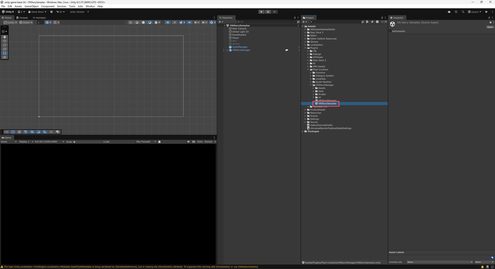

- 示例场景
  - Assets\Plugins\Pixel Crushers\VNStoryManager\VNStorySamples.unity
  - 打开示例场景，直接 运行游戏 就能在 Game窗口中看到剧情演出的内容。

<video controls="" poster="" src="Movie_011.mp4" ></videos>

- 示例视频
  - 可以在 [视频链接](Movie_011.mp4) 中，点击 [View raw]按钮，下载视频进行观看。

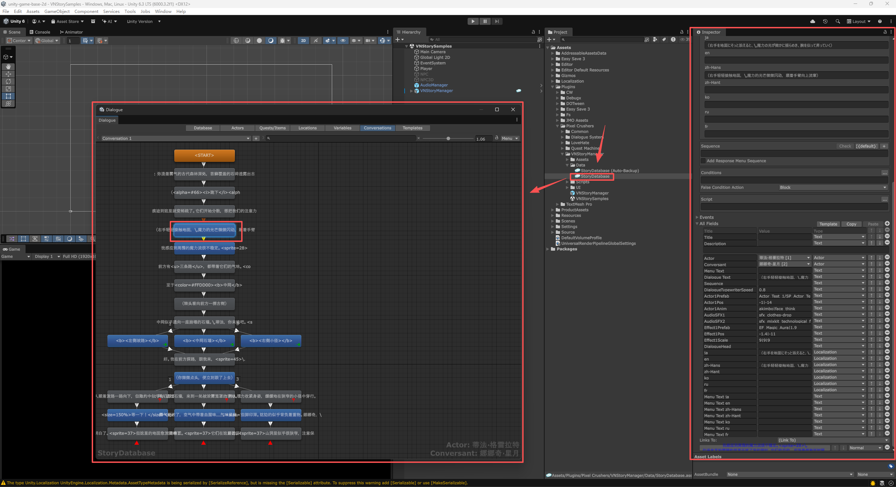

- 剧情演出配置
  - 示例场景的 剧情演出数据的配置，具有很多参考价值。
  - 例如，通过 对话节点上的 All Fields (所有数据)添加特定的 配置条目，配置场景的 背景、角色、特效、音频等效果。
  - 详细的配置方法，也会在之后的教程中进行解说。

# 测试场景

示例场景 仅作为功能的演示。在制作 正式的游戏资产 与 配置时，请使用已经创建好的 正式游戏资产。
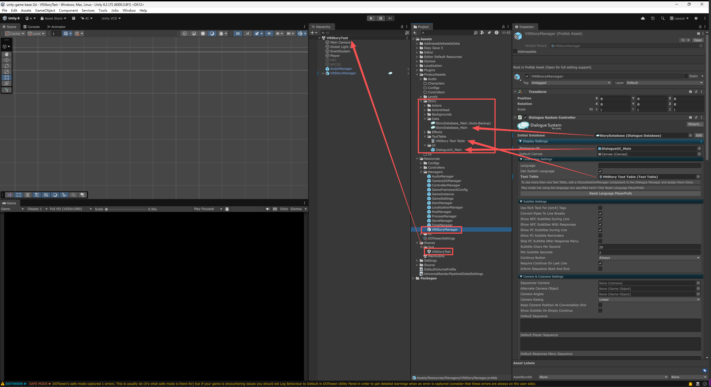

- 正式游戏资产
  - 剧情演出管理器：Assets\Resources\Managers\VNStoryManager.prefab
  - 角色预制体：Assets\ProductAssets\Story\Actors\
  - 角色头像：Assets\ProductAssets\Story\ActorsHead\
  - 背景图片：Assets\ProductAssets\Story\Backgrounds\
  - 特效预制体：Assets\ProductAssets\Story\Effects\
  - 剧情演出数据：Assets\ProductAssets\Story\Data\StoryDatabase_Main.asset
  - 多语言文本表：Assets\ProductAssets\Story\TextTable\VNStory Text Table.asset
  - UI界面预制体：Assets\ProductAssets\Story\UI\DialogueUI_Main.prefab
- 测试场景
  - Assets\Scenes\Test\VNStoryTest.unity
  - 打开测试场景，直接 运行游戏 就能在 Game窗口中看到 剧情演出的内容。

# 快速入门

通过最简洁的流程，快速熟悉 剧情演出 系统。\
而关于 详细的配置方法，会在之后的教程中 逐一进行解说。

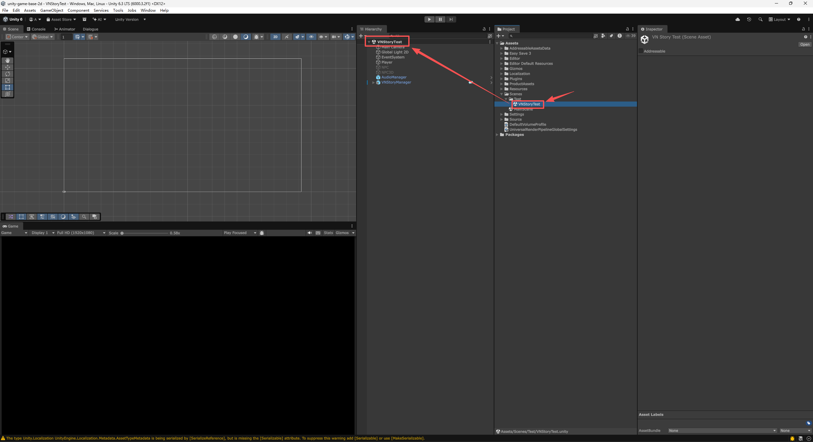

- 打开测试场景。
  - 打开 Assets\Scenes\Test\VNStoryTest 场景。
  - 在测试场景中，可以直接进入 剧情演出 来进行测试。

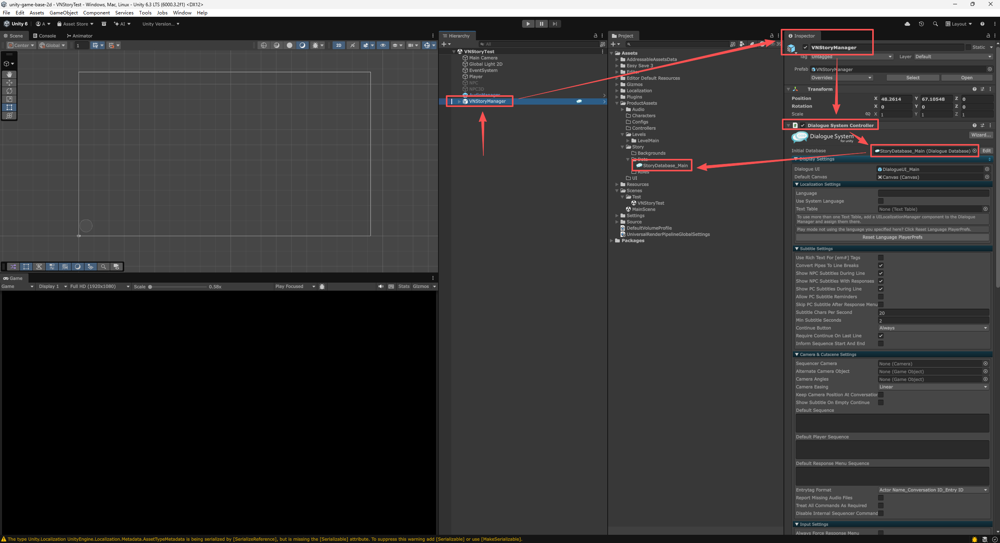

- 找到 剧情演出的 数据文件。
  - 在 Hierarchy 面板中，显示了 当前场景中的 所有物体。
  - 选中 VNStoryManager 物体，在 Inspector 面板中，会显示 选中物体的 所有组件 及其 数据。
  - 在 DialogueSystemController 组件上，配置了一些 剧情演出相关的数据。
  - 点击组件中 Initial Database 栏右侧 配置的数据文件，就会在Project面板中 快速找到 指定的文件。
    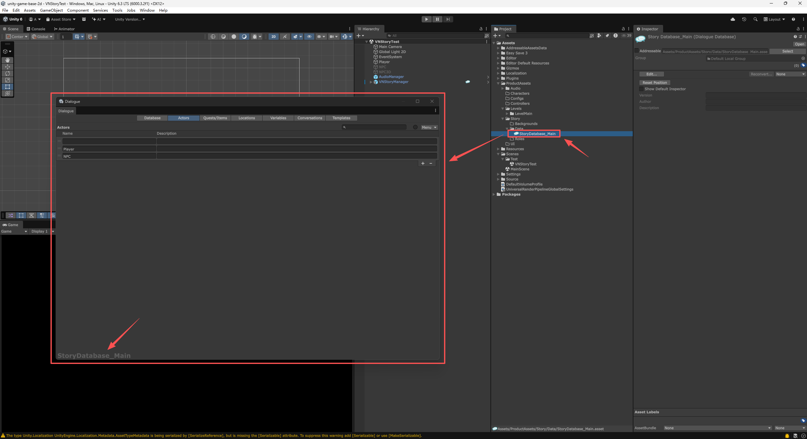
  - 鼠标双击，就可以打开 剧情演出 的编辑窗口。
  - 在 Dialogue编辑器窗口 的左下角，会显示正在编辑的 剧情演出的 数据文件名称。
  - 之后，需要使用该 编辑器窗口，进行所有 剧情演出 相关的数据配置。

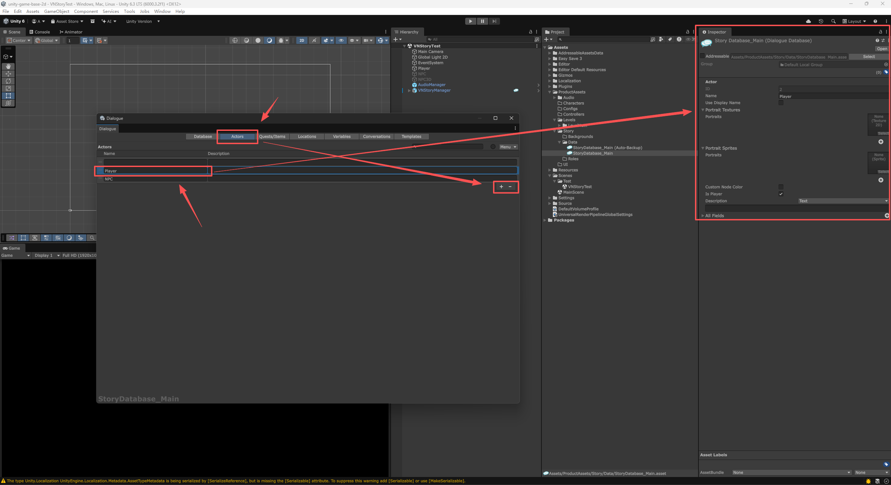

- 编辑 角色数据。
  - 选中上方列表中的 Actors 页面，在这里 可以增删所有的 出场角色 并进行编辑。
  - 点击右侧的[+][-]符号，可以对 角色条目 进行 增加或删除。
  - 选中需要编辑的 角色条目，在 Inspector 面板中，就会显示 对应的数据。
  - 详细的数据讲解，会在之后的教程进行说明，这里 先直接使用已有的 “旁白”“玩家”“配角”的 角色数据。

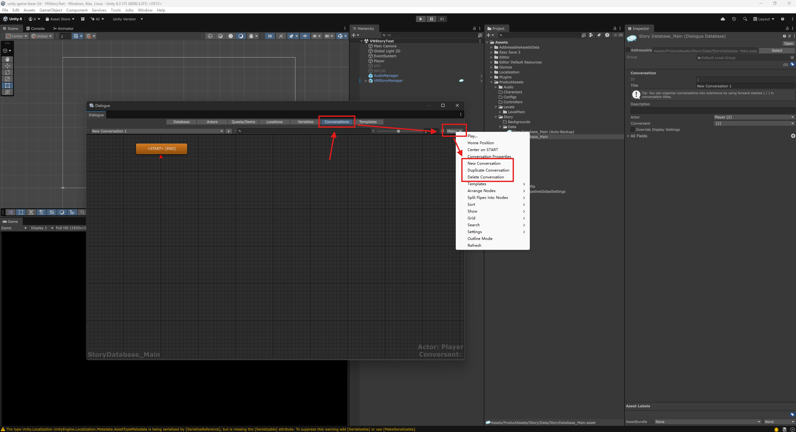

- 编辑 剧情演出数据。
  - 选中上方列表中的 Conversations 页面，在这里 可以编辑 剧情演出的 对话流程、对话数据 与 场景演出。
  - 点击右上角的[Menu]，会显示 各类操作按钮。点击[New Conversation]创建一个 新的剧情演出。
  - 通过[Delete Conversation]可以删除 当前正在编辑的 剧情演出。
    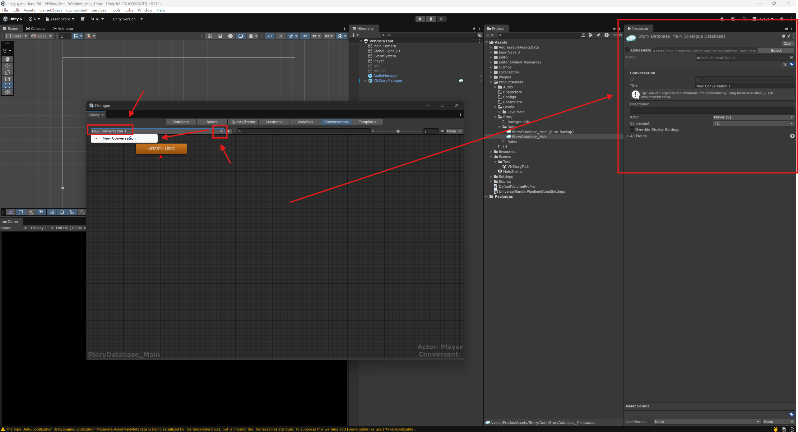
  - 一个 Conversation 就是一场完成的 剧情演出。
  - 左上角会显示 当前编辑中的 Conversation，点击后 会显示 所有Conversation的下拉列表。在列表中进行 Conversation的切换。
  - 点击下方的空白处，在 Inspector面板中 就会显示 Conversation的 数据详情。例如，在Title栏中，可以修改 Conversation的名称。例如，可以修改为“第一章-第一节”。

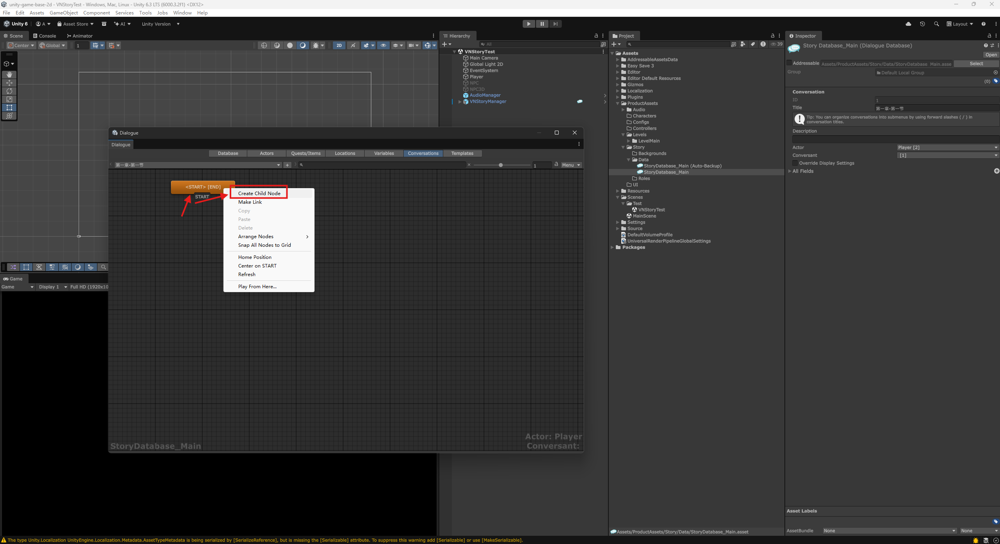

- 编辑 剧情演出数据-对话节点。
  - 在<START>节点上，鼠标右键 打开操作菜单，点击[Create Child Node]按钮，就可以快速创建下一个 对话节点。
    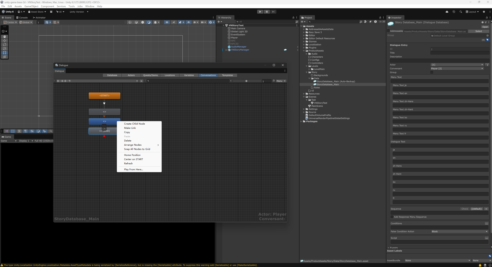
  - 连续在新的 对话节点 上，通过[Create Child Node]来创建 连续的 对话节点流程。
  - <START>标记了开始的 对话节点，通常是不可编辑的，仅作为 对话开始的标记。
  - <END>标记了结束的 对话节点，根据对话流程 也会存在多个<END>节点。
    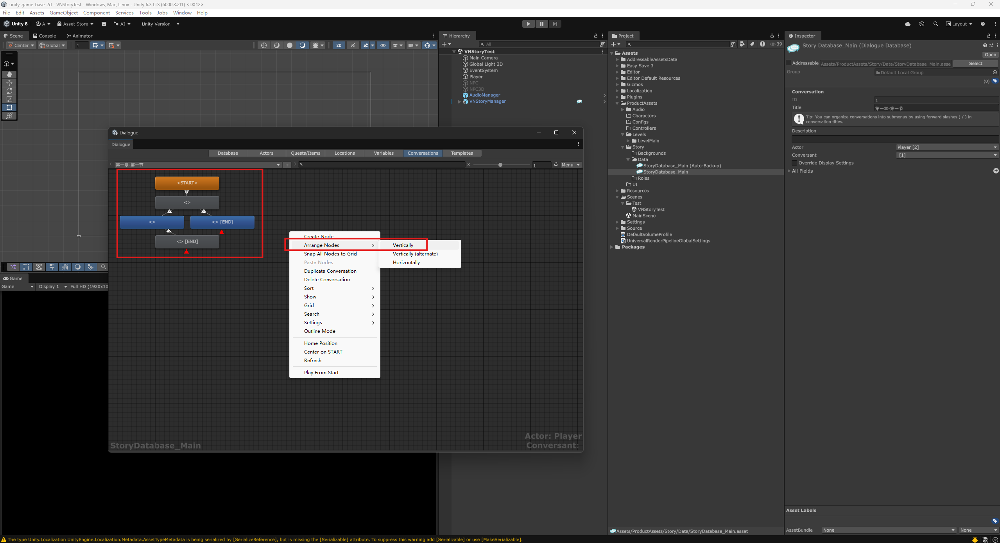
  - 对话节点 上可以通过[Create Child Node]来快速创建多个 后续对话节点，作为 对话流程的分支。
  - 如果 多个分支的 对话节点 的 说话的角色(Actor)是玩家时，游戏中就会出现 分支选项菜单(Response Menu) 由玩家进行选择。
  - 创建的 后续对话节点，可能会重叠在一起。在空白处 鼠标右键 展开操作菜单，点击 Arrange Nodes 中的按钮，可以 自动排版。
  - 建议使用 Vertically(alternate)，获得 垂直且紧凑的 节点排版。
    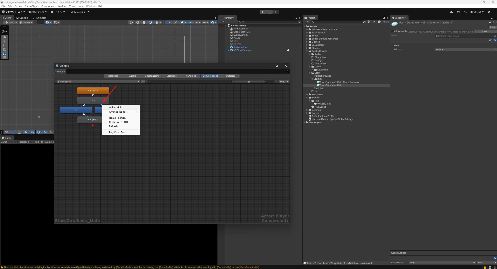
  - 节点与节点之间的流程，会通过 →箭头链接 来标明 对话的流程。
  - 鼠标左键 点击，就可以选中 →箭头链接，再鼠标右键 展开箭头链接的 操作菜单。
  - 通过[Delete Link]就可以删除 →箭头链接。
    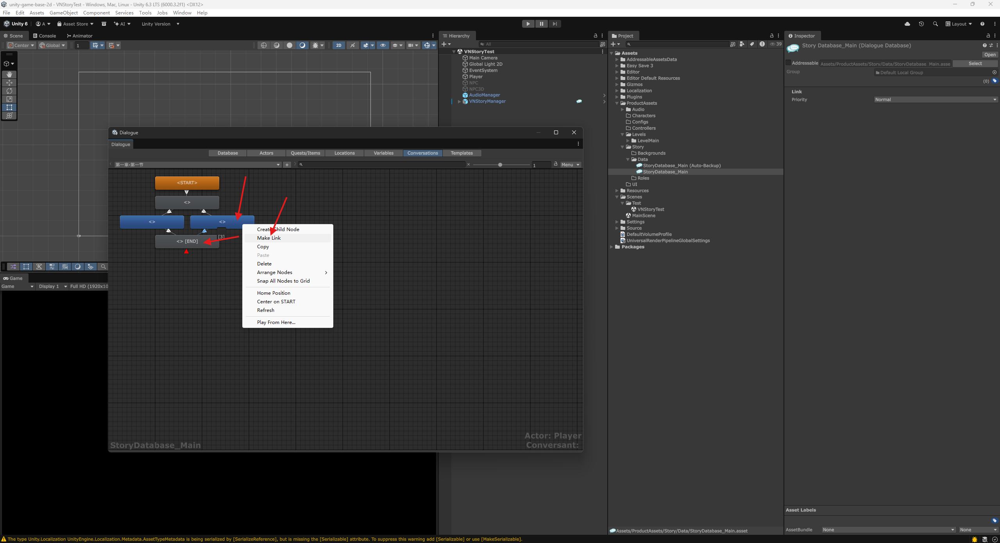
  - 想要将 两个对话节点 进行链接，需要在 作为起点的 对话节点上鼠标右键 展开操作菜单。点击[Make Link]来创建 →箭头链接。
  - 之后，点击 作为终点的 对话节点，就可以完成 两个对话节点 的链接。
    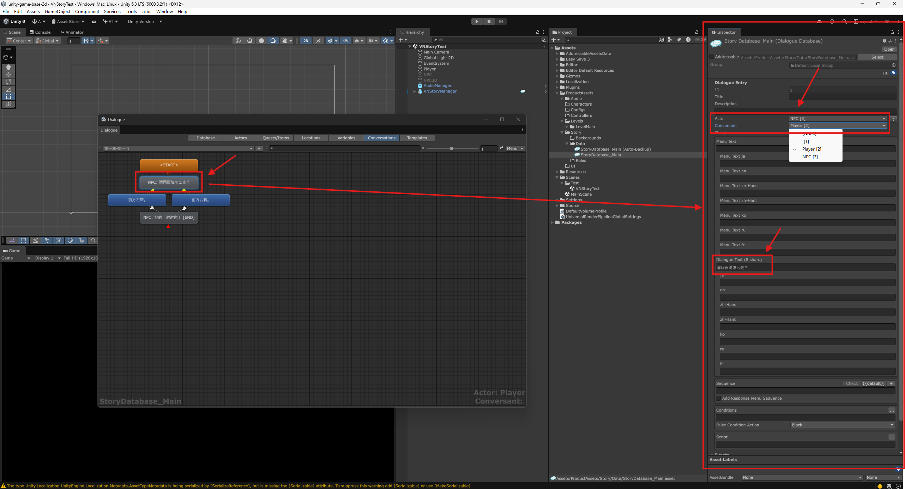
  - 点击选中某个 对话节点，在 Inspector面板中 就会显示该对话节点的 详细数据。
  - Actor条目 是 说话的角色，可以点击右侧的下拉菜单 进行切换。在流程图中 通常显示为 蓝色的节点。
  - Conversant条目 是 谈话对象的角色，可以点击右侧的下拉菜单 进行切换。在流程图中 通常显示为 灰色的节点。
  - Dialogue Text条目 中 填写对话的文本。
  - 还会有其他的 背景、角色、头像、特效 的条目 用于相关的配置。详细的配置方法，会在之后的教程中进行解说。
  - 至此，剧情演出的 对话流程 的基础配置，就完成了。

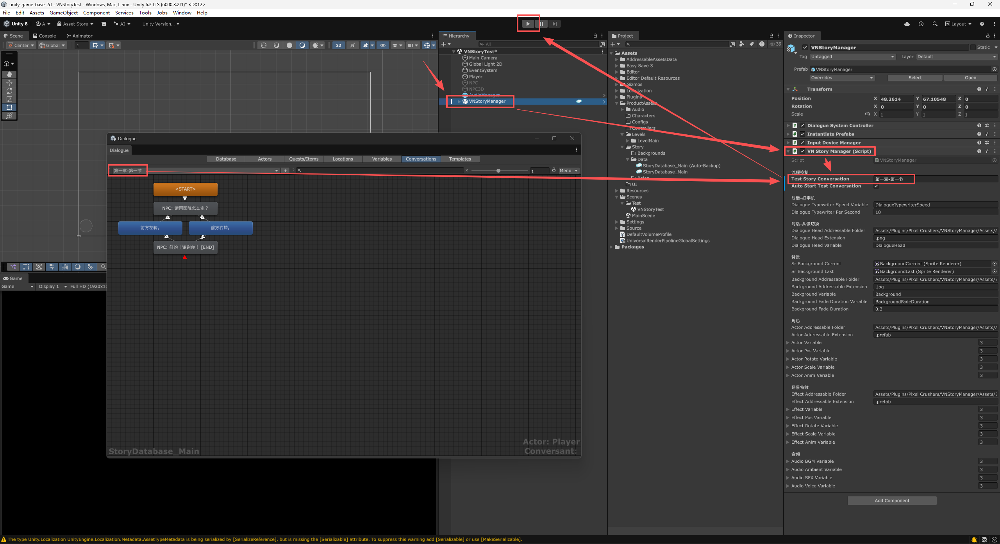

- 测试 剧情演出 对话流程。
  - 打开 Assets\Plugins\Pixel Crushers\VNStoryManager\VNStorySamples.unity 测试场景。
  - 点击选中 场景中的 VNStoryManager 物体，在 Inspector 面板中找到 VN Story Manager组件。
  - Test Story Conversation栏中，填写 想要测试的 Conversation 的名称。即之前在Conversation的Title栏中填写的“第一章-第一节”。
  - 勾选 Auto Start Test Conversation，运行游戏时 就会自动运行 Test Story Conversation 中配置的剧情演出。
  - 最后，点击 上方中央的[开始]按钮 就可以运行游戏，进行剧情演出的测试。
    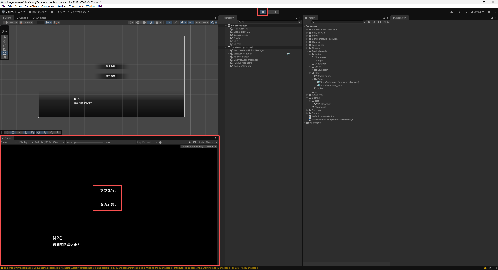
  - 在 Game 面板中，就会显示 实际的 剧情演出的游戏画面。分支选项 会显示在游戏画面的中央。
  - 运行游戏后，上方中央的[开始]按钮 会转变为[停止]按钮，点击后即可 停止游戏的运行。
  - 因为还没有配置 场景中的 背景图片，所以整个场景都是黑色的。在之后的教程中，会详细讲解 场景的配置。

# 资源配置

资源文件夹路径、文件类型、对话节点的 字段条目名称 等。\
不过，剧情演出管理器 预制体上 已经做好了相关的配置，如无需要 **<可不进行修改>**。

## 剧情演出管理器 预制体

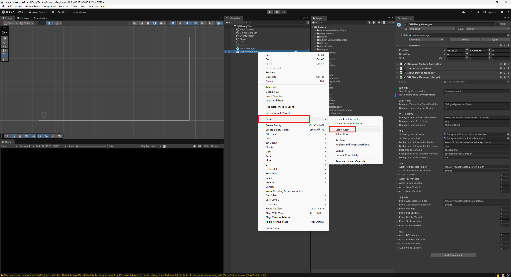

- 相关的配置，需要在 剧情演出管理器 预制体上进行。建议直接在 Project 面板的 预制体源文件上 进行配置的修改。
- 场景中的所有物体 会显示在 Hierarchy 面板中，蓝色的物体代表是预制体，鼠标右键 场景中的预制体，点击操作菜单中的[Prefab > Select Asset]就能在 Project 面板中，快速找到并选中 预制体的源文件。

### 「文件路径与类型」

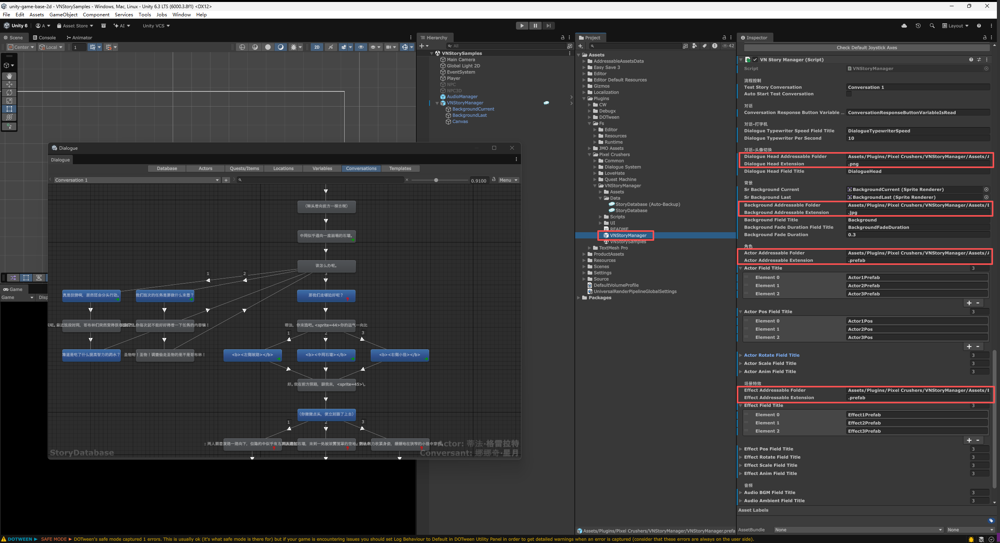

- 需要配置 文件路径 与 文件类型 的，有 背景、角色、角色头像、场景特效。只有放置到 指定文件夹中的 美术资源，才可以在 Dialogue System 的 Conversation 中在 对话节点 上进行配置。
- 文件夹路径 的格式为 Assets/ProductAssets/Story/ActorsHead/，以Assets开头，文件夹后面使用“/”隔开，所以 最后也需要使用“/”进行结尾。
- 文件类型扩展名，通常是根据需要进行配置的。例如，头像图片 会有透明区域，所以一般会使用.png。而 背景图片 通常是没有透明区域的 一整张图片，所以使用.jpg。而 角色 与 特效，通常是带有 Unity功能的预制体，所以使用.prefab。
  - BackgroundAddressableFolder：背景，文件夹路径。
  - BackgroundAddressableExtension：背景，文件类型扩展名。
  - ActorAddressableFolder：角色，文件夹路径。
  - ActorAddressableExtension：角色，文件类型扩展名。
  - DialogueHeadAddressableFolder：角色头像，文件夹路径。
  - DialogueHeadExtension：角色头像，文件类型扩展名。
  - EffectAddressableFolder：场景特效，文件夹路径。
  - EffectAddressableExtension：场景特效，文件类型扩展名。

### 「字段条目的标题」

- Variable结尾的条目，配置了用于 对话节点中的 背景图、角色、特效、音频等配置的 字段条目的标题。可以直接使用 默认的配置，**<可不进行修改>**。

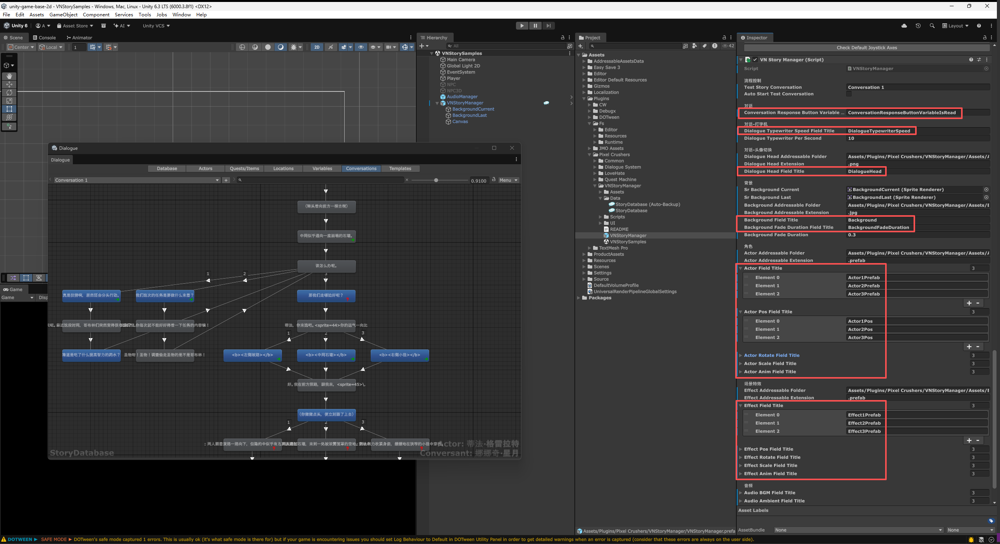

- 角色、特效等 能够同时出现多个，因此对应的 字段条目 数量也可以通过 对应的[+][-]按钮 来进行增删。
  - BackgroundVariable：背景。
  - BackgroundFadeDurationVariable：背景。淡入淡出的时间(秒)。默认为0.3秒。
  - ActorVariable：角色。
  - ActorPosVariable：角色位置。内容值的格式为 [世界坐标X|世界坐标Y|世界坐标Z|移动速度倍率]。
  - ActorRotateVariable：角色旋转。内容值的格式为 [旋转角度X|旋转角度Y|旋转角度Z|旋转速度倍率]。
  - ActorScaleVariable：角色缩放。内容值的格式为 [缩放X|缩放Y|缩放Z|缩放速度倍率]。
  - ActorAnimVariable：角色动画。内容值的格式为 [动画Key1|动画Key2|动画Key3]。
  - DialogueHeadVariable：角色 对话框头像。
  - EffectVariable：特效。
  - EffectPosVariable：特效位置。内容值的格式为 [世界坐标X|世界坐标Y|世界坐标Z|移动速度倍率]。
  - EffectRotateVariable：特效旋转。内容值的格式为 [旋转角度X|旋转角度Y|旋转角度Z|旋转速度倍率]。
  - EffectScaleVariable：特效缩放。内容值的格式为 [缩放X|缩放Y|缩放Z|缩放速度倍率]。
  - EffectAnimVariable：特效动画。内容值的格式为 [动画Key1|动画Key2|动画Key3]。

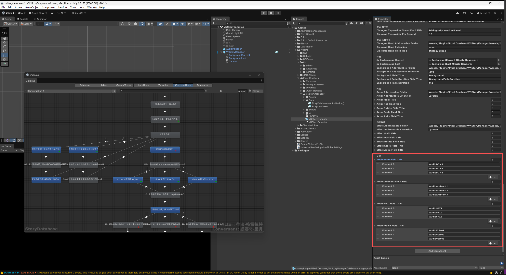

- 音频文件 虽然无需配置 文件夹路径，但需要在 音频系统中进行提前配置。配置方法 会在之后的教程中进行解说。
  - AudioBGMVariable：背景音乐。内容值的格式为 [音频名称Key|音量|音调|延迟播放时间]。
  - AudioAmbientVariable：环境音。内容值的格式为 [音频名称Key|音量|音调|延迟播放时间]。
  - AudioSFXVariable：特效音。内容值的格式为 [音频名称Key|音量|音调|延迟播放时间]。
  - AudioVoiceVariable：语音。内容值的格式为 [音频名称Key|音量|音调|延迟播放时间]。

# 资源导入

在 剧情演出 中使用的各类 美术资源、通常有 图片、音频、Spine动画、预制体 等。\
具体的导入方法与流程，可以参考 [资源导入文档](../../../../Fs/Runtime/GameFramework/Common/Systems/AssetSystem/Docs~/AssetImport/AssetImport.md)。

## 背景图片的导入

- 背景图片的导入
  - 直接将 图片文件 鼠标拖拽到 Project 面板的 Assets/ProductAssets/Story/Backgrounds/ 文件夹中。
- 背景图片的使用
  - 请查看 [场景的背景](#场景的背景)。

## 角色头像图片的导入

- 头像图片的导入
  - 直接将 图片文件 鼠标拖拽到 Project 面板的 Assets/ProductAssets/Story/ActorsHead/ 文件夹中。
- 头像图片的使用
  - 请查看 [更换头像图片](#更换头像)。

## 角色的导入

### 「Spine动画预制体」

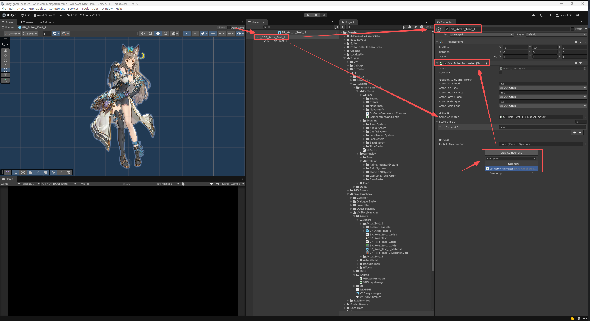

- 添加 VN Actor Animator 组件。
  - 鼠标单击 选中 Hierarchy面板中的 预制体的根物体。
  - 在 Inspector面板中 点击 [Add Component]按钮 添加 VN Actor Animator 组件。可以在 搜索框 中进行搜索。
  - VN Actor Animator 组件的 Spine Animator Base 通常会自动获取。
    - 自动获取失败时，需要手动指定。把 Hierarchy面板中的 Spine GameObject (图示中命名为SP_Role_Test_1) ，鼠标拖拽到 VN Actor Animator 组件的 Spine Animator Base 栏中，作为 基础的Spine动画对象 进行使用。

## 特效的导入

- 特效的使用
  - 请查看 [场景的特效](#场景的特效)。

## 音频的导入

- 音频的导入
  - 直接将 音频文件 鼠标拖拽到 Project 面板的 Assets/ProductAssets/Audio/ 文件夹下 对应类别的 音
- 音频的使用
  - 请查看 [场景的音频](#场景的音频)。

## 富文本图标的导入

可以在 对话框的文本中 插入显示 指定的图标。

- 富文本图标的使用。
  - 请查看 [富文本图标](#富文本符号)。

# 剧情演出配置

使用 Dialogue System 的 剧情编辑器，对 剧情数据 进行编辑。创建 并配置 剧情演出相关的 角色、对话流程 等数据。

## 字段条目

角色、对话节点 等对象上，会保存对应的 数据。而所有的数据 均以 字段条目的形式进行配置。

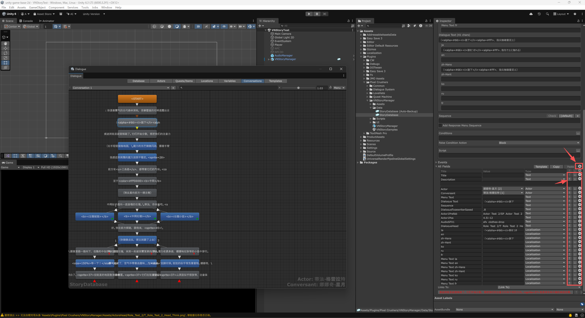

- 在 All Fields 中，会显示所有的 字段条目。
  - 鼠标单击 All Fields 就可以展开 所有字段条目 的列表。
  - 其中一部分 主要的字段条目 还会在Inspector的上面区域 再次显示。**<不要删除 主要的字段条目>**。
  - 通过右边的[+][-]按钮，可以 增加或删除 自定义的 字段条目。
  - 通过右边的[↑][↓]按钮，可以 调整条目的顺序，进行整理。

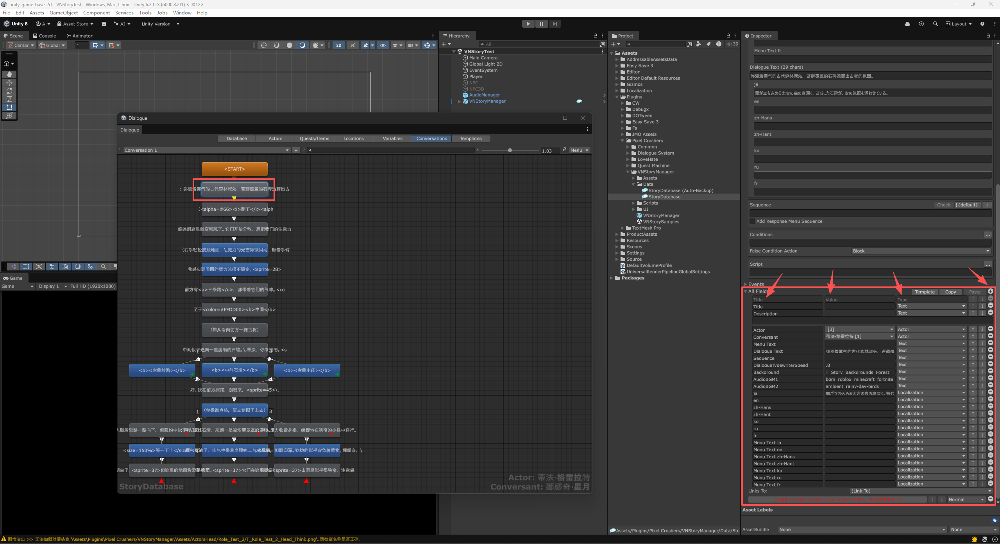

- 在条目的 各个栏目中，配置字段条目的 类型、名称、内容值。以此来制作 剧情演出的 所有内容。
  - Title：字段标题。标明了这个字段条目的 标题名称，告诉 剧情演出系统，这个字段条目 是作为什么功能使用的。
    - 例如，Background 的字段标题，是作为配置 场景中的背景图片 来进行使用的。
    - 剧情演出中使用的 [字段条目名称](#字段条目名称)，在之前的 剧情演出管理器 预制体 上，可进行自定义修改。
  - Value：内容值。用于配置 字段条目 中包含的具体的 内容的值。
    - 例如，Dialogue Text 字段条目中，就需要在Value中填写具体的 对话文本。而 Background 字段条目中，则需要在Value中填写具体的 背景图片的 文件名称。
  - Type：条目类型。标明了这个 字段条目 是以什么方式 来进行使用的。
    - Actor 角色类型。从 Acotrs 页面配置好的 角色条目中，进行选择。
    - Text 文本类型。填写 对话的文本 或 文件名称的 文本类型。具体的 文本格式 与 使用方式 通常是根据 具体的字段条目而定。
    - Boolean 真假类型。只有 真 或 假 两种状态的值类型。通常以 √勾选 或 true/false选项 的方式进行配置。
    - Localization 多语言类型。角色名称、角色描述、对话文本等内容值，根据游戏设定的语言 需要进行切换。通常是[字段条目名称]+[语言代码]格式的 字段条目名称。详细的教程，会在之后的 [多语言条目](#多语言条目) 中进行解说。

## 全局变量

使用全局变量，存储数据 并进行使用。
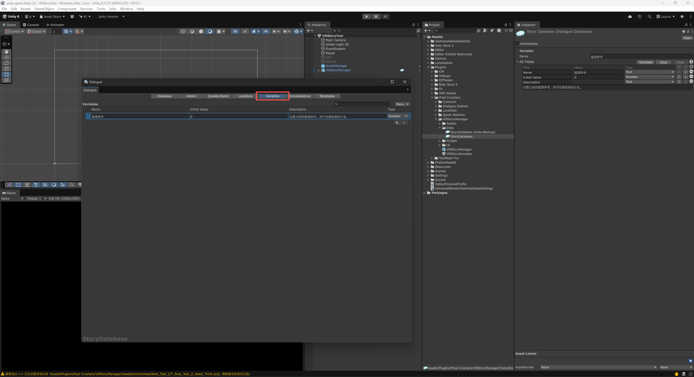

- 点击上方页面列表中的 Variable，切换到 全局变量页面。
- 通过右下的[+][-]按钮，就可以添加或删除 变量条目。
- 变量条目
  - Name：变量名称。用于标明并识别变量。
  - Initial Value：初始 内容值。游戏开始时，变量的默认值。
  - Description：描述。**<非必须>**。仅作为 备注。
  - Type：变量类型。决定了可以存储的 值的类型。Number 数字、Text 文本、Actor 角色、等。
- [分支对话节点](#分支对话节点) 中的应用。
  - 保存某个 分支选项的 玩家的选择 的 数字序号，作为后续 分支节点的 判断条件，影响 分支节点 的走向。

## 角色

在Actors页面中，进行出场角色的配置。
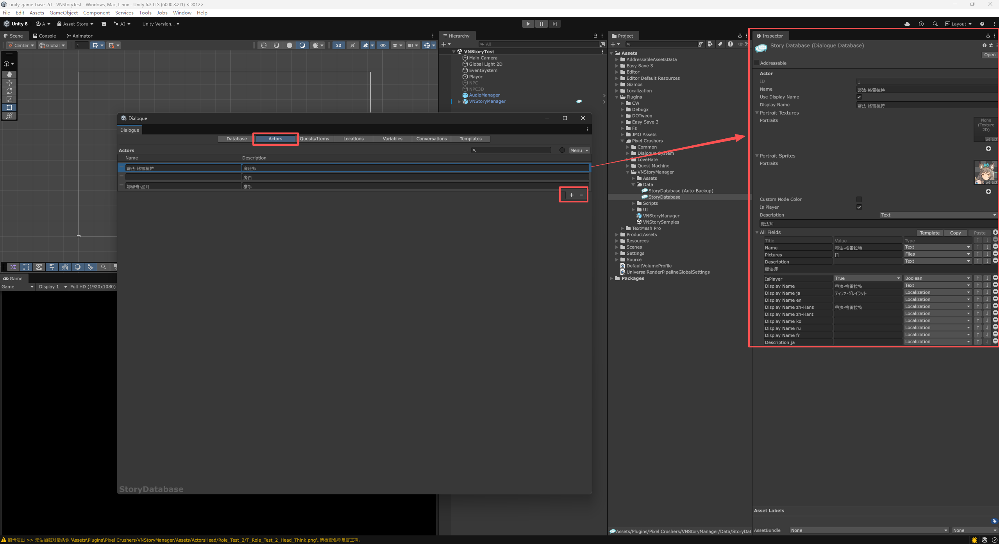

- 点击上方页面列表中的 Actors，切换到 角色列表页面。
- 通过右下的[+][-]按钮，就可以添加或删除 角色条目。
- 鼠标单击 就可以选中 想要编辑的 角色条目。右侧的 Inspector 面板中 会显示角色的 数据详情。
- 配置条目
  - ID：角色编号。自动生成，无需手动配置。
  - Name：角色名称。用于标明 该角色的名称。可以是英文的 序号名，仅用于角色条目的 分类 与 标记。
  - Use Display Name：使用“显示名称”。需要保持√勾选。
  - Display Name：游戏中的显示名称。文案中使用的 角色名称。
  - Portrait Textures：角色头像。Unity中的Texture格式的图片。 **<本项目中不使用>**。
  - Portrait Sprites：角色头像。Unity中的Sprite格式的图片。在这里配置 默认的角色头像 图片。使用 [导入的头像图片](#角色头像图片的导入)。
  - Custom Node Color：自定义节点颜色。自定义 Conversations中 对话节点 的颜色，便于快速识别 该角色。
  - Is Player：是否为 玩家角色。玩家的角色 需要√勾选，而其他 配角的角色 则不要√勾选。
  - Description：描述。对该角色 进行简单的描述。

## 对话节点

在 Conversations 页面中，进行剧情演出的 对话流程 的配置。对话节点、分支流程。
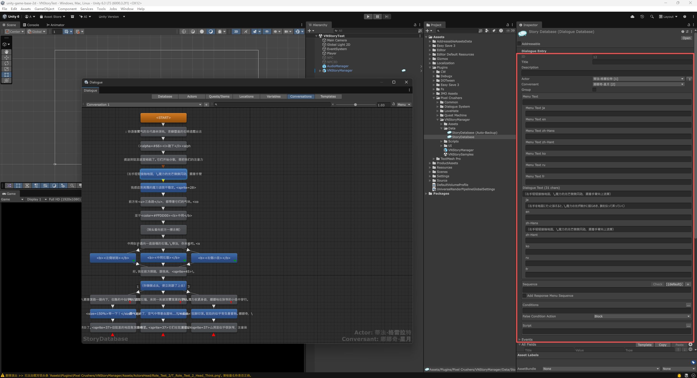

- 点击上方页面列表中的 Conversations，切换到 角色列表页面。
- 关于 对话节点 的 增加、删除、链接、排版、编辑，可以参考[快速入门](#快速入门)与[官方教程](#官方教程)的内容。
- 配置条目
  - ID：对话节点 编号。自动生成，无需手动配置。
  - Title：标题。**<非必须>**。仅作为 备注，可用于分类。
  - Description：描述。**<非必须>**。仅作为 备注。
  - Actor：说话的角色。
  - Conversant：谈话对象的角色。
  - Group：是否为 组节点。**<非必须>**。设置为 组节点后，该节点会失去其他功能 仅作为中转节点，到达此节点后 会直接转跳至下一节点。不会播放 对话文本，也无法对 场景中的对象 进行配置。通常是对 复杂的节点流程 进行分组整理时 使用。
  - Menu Text：菜单文本。如果该节点 是 分支选项节点 中的一个时，菜单文本会作为 选项上显示的文本 来使用。未配置时，会默认使用 Dialogue Text 中的文本。
  - Dialogue Text：对话文本。对话台词的文本内容。显示在 对话框 中。可以通过 [富文本符号](#富文本符号) 来实现丰富的文本效果。
  - Sequence：过场动画序列。**<非必须>**。使用Lua代码编写简单的代码，来实现复杂的 过场动画序列功能。详情请参照 [官方教程](#官方教程) 与 [官方文档-过场动画序列](https://www.pixelcrushers.com/dialogue_system/manual2x/html/cutscene_sequences.html)。
  - Add Response Menu Sequence：分支选项的 过场动画序列。如果该 对话节点 是分支选项的其中一个，在玩家选择该 分支选项后，会立刻停止正在播放的 Sequence 中的 过场动画序列，马上开始播放 Response Menu Sequence 的 过场动画序列。
  - Conditions：条件列表。满足条件 才能够进入的 对话节点。详细的使用方法，会在 [分支对话节点](#分支对话节点) 进行讲解。
  - Script：执行脚本。在本节点会执行的行为。详细的使用方法，会在 [分支对话节点](#分支对话节点) 进行讲解。
  - Events：事件。**<非必须>**。进入该 对话节点 时 发送的Unity事件。通常由 开发人员 进行使用。
  - All Fields：所有的 数据 字段条目。该 对话节点 上的所有 数据字段条目。剧情演出相关的 字段条目，如 [更换头像图片](#更换头像)、场景的 [背景](#场景的背景)、[角色](#场景的角色)、[特效](#场景的特效)、[音频](#场景的音频) 等配置，会在之后的教程中进行讲解。
    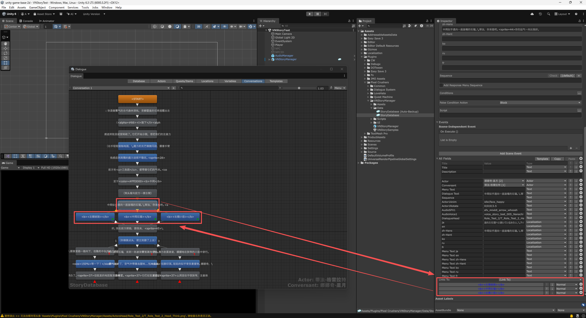
  - Links To：链接子节点。**<非必须>**。显示了所有 链接的下一个 子节点的列表。使用右侧的[↑][↓]按钮来调整顺序，使用最右侧的[优先级类型]来修改 优先级。

## 分支对话节点

当一个 对话节点 的后续，存在多个 对话节点 时，就会形成 分支对话节点。
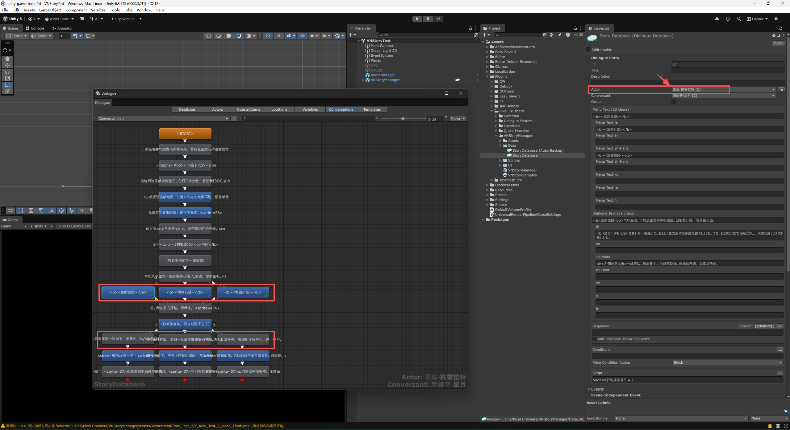

- 玩家分支节点
  - 当分支节点的Actor设置为 玩家时，所有的分支节点 会作为 分支选项菜单(Response Menu) 显示在 游戏的剧情演出中，由玩家进行选择。
- 配角分支节点
  - 当分支节点的Actor设置为 配角时，所有的分支节点 会通过 条件列表 来判断是否满足 进入节点的条件。

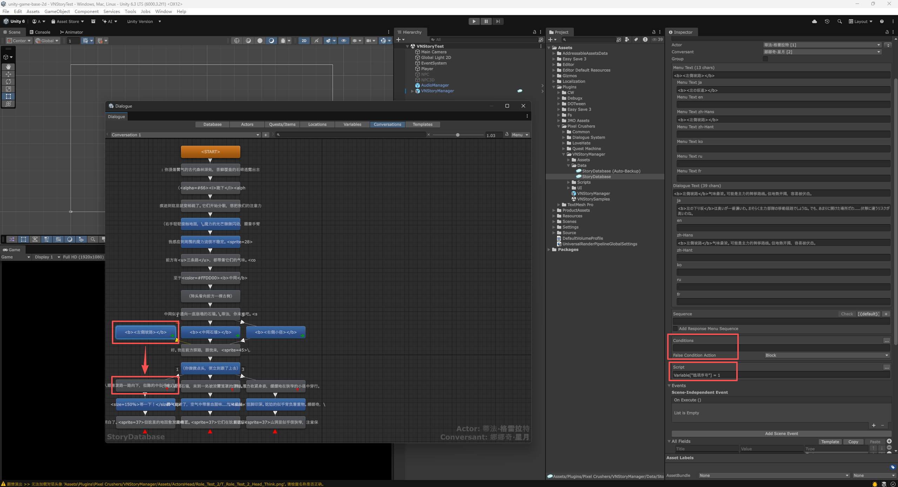

- 通过 [全局变量](#全局变量) 可以保存玩家在 玩家分支选项 的 选择，并在后续的 配角分支节点 作为判断条件，以此影响后续的 分支节点的 走向。
  - 如图所示，在 Script(脚本行为) 中，将“选项序号”这个全局变量 的 内容值 设置为 1，其他两个 分支节点 分别是设置为 2 与 3。
  - 之后，在 Conditions(判断条件) 中，判断“选项序号”这个全局变量 的 内容值 是否为 1，其他两个 分支节点 分别是判断是否为 2 或 3。
  - Script(脚本行为) 与 Conditions(判断条件) 的配置方式，会在下方的教程中进行解说。

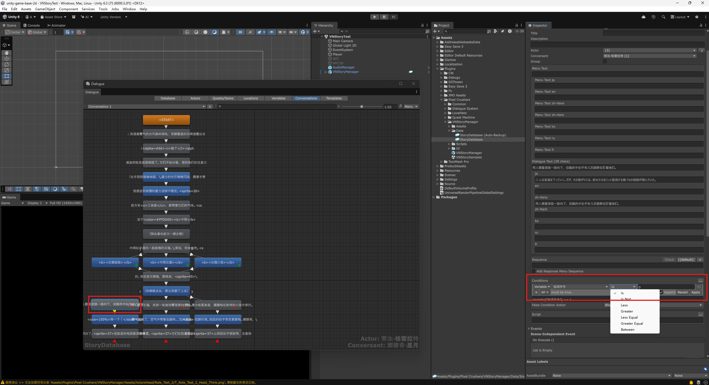

- Conditions：条件列表。满足条件 才能够进入的 对话节点。
  - 通常用于 分支的 对话节点 分别设置成不同的条件，通过条件来决定会进入哪个分支的 对话节点。例如，使用 好感度的数值要求 作为条件。
  - 配置了 判断条件 的 对话节点，右下角会有红色的 **<?>** 标记。
  - 点击右上的[...]按钮，可以打开 添加条件菜单。点击菜单 最左侧的[+]按钮，就可以添加1个条件。
  - 最左侧是 条件类型，不同的条件类型 可以取得不同的条件数据 并进行判断。
  - 例如，[Variable类型](#全局变量) 就可以判断指定的 变量值是否 达到要求。
  - 第二个选项 是选择要判断的 变量名称。
  - 第三个选项 是判断方式。Is 是、Is Not 不是、Less 小于、Greater 大于、Less Equal 小于等于、Greater Equal 大于等于、Between 两者之间。
  - 第四个输入框 是要求的 内容值。例如，要求内容值是2的条件，就配置为 Is 2。
  - Append：是否 附加。√勾选时，条件菜单 中配置的条件 会附加到 现有的条件上。反之，会清空现有条件 只使用现在 条件菜单 中配置的条件。
  - Revert：复原。取消本次 条件菜单 的条件，保持原来的条件。
  - Apply：应用。应用本次 条件菜单 的条件，附加 或 覆盖 条件文本框中的 现有条件。
  - 条件文本框：最下方的文本框中，以Lua代码的格式 写入了现有的条件。可以使用上述的 条件菜单 进行修改，无需手动书写。
  - False Condition Action：未满足条件时的行动。Block阻挡，不能进入该 对话节点。Passthrough通过，能够进入该 对话节点。一般会设置为Block。

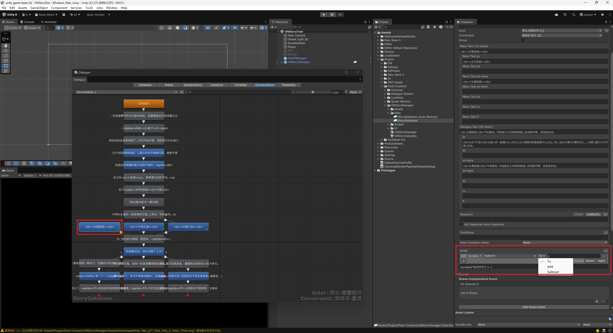

- Script：执行脚本。在本节点会执行的行为。
  - 通常用于 分支的 对话节点 保存 玩家的选择，作为之后的 对话节点 的 行为，以此影响后续的 分支流程 的走向。
  - 配置了 脚本行为 的 对话节点，右下角会有绿色的 **<→>** 标记。
  - 点击右上的[...]按钮，可以打开 添加行为菜单。点击菜单 最左侧的[+]按钮，就可以添加1个行为。
  - 最左侧是 行为类型，不同的行为类型 可以执行不同的操作，修改不同类型的数据。
  - 例如，[Variable类型](#全局变量) 就可以对 指定的 全局变量条目 的 内容值 进行修改。
  - 第二个选项 是选择要修改的 变量名称。
  - 第三个选项 是修改方式。To 设置为、Add 增加、Subtract 减少。
  - 第四个输入框 是执行的 内容值。例如，将指定 变量条目 的 内容值 设置为 3，就配置为 To 3。
  - Append：是否 附加到现有的 脚本行为之后。
            - √勾选时，脚本行为菜单 中配置的 脚本行为 会附加到 现有的 脚本行为上。
            - 不勾选时，会清空现有的 脚本行为 只使用现在 脚本行为菜单 中配置的 脚本行为。
  - Revert：复原。取消本次 行为菜单 的行为，保持原来的行为。
  - Apply：应用。应用本次 行为菜单 的行为，附加 或 覆盖 行为文本框中的 现有行为。
  - 行为文本框：最下方的文本框中，以Lua代码的格式 写入了现有的行为。可以使用上述的 行为菜单 进行修改，无需手动书写。

## 消息提示

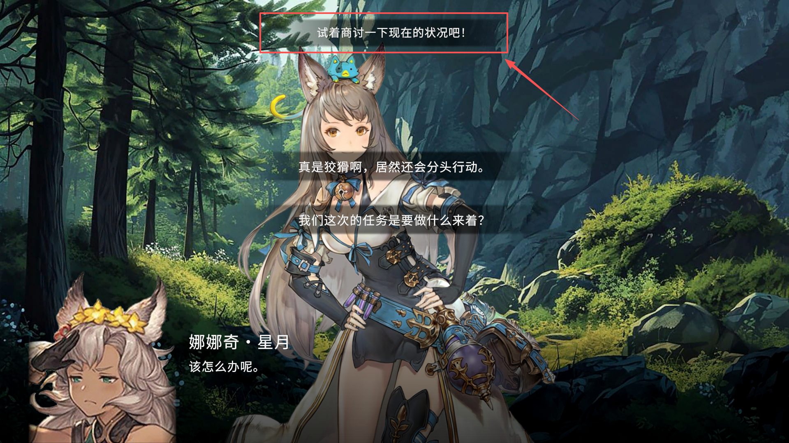
在对话过程中，弹出 消息提示气泡。

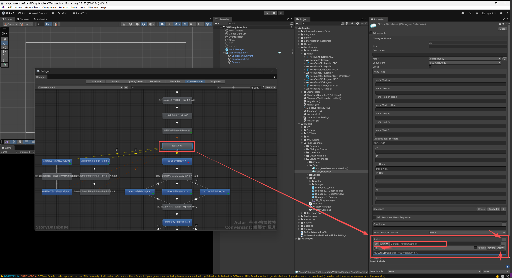

- 在 对话节点上，添加一个 消息提示的 脚本行为。
  - 选中需要添加 消息提示的 对话节点，在 Inspector面板中，找到 Script(执行脚本) 栏。
  - 点击右侧的[...]按钮，打开 添加 脚本行为菜单。
  - 点击菜单 最左侧的[+]按钮，添加一个新的 脚本行为。
    - 脚本类型：最左侧的下拉菜单中，选择 Alert，设置为 消息提示类型。
    - 输入框：右侧的输入框中，填写 消息提示的文本内容。例如“试着商讨一下现在的状况吧！”。
  - 点击 [Apply]按钮，就可以将这个 消息提示的 脚本行为 应用到 当前的 对话节点 上了。
    - Revert：复原按钮。取消这个 消息提示的 脚本行为，保持原来的行为。
    - Append：是否 附加到现有的 脚本行为之后。
      - √勾选时，脚本行为菜单 中配置的 脚本行为 会附加到 现有的 脚本行为上。
      - 不勾选时，会清空现有的 脚本行为 只使用现在 脚本行为菜单 中配置的 脚本行为。

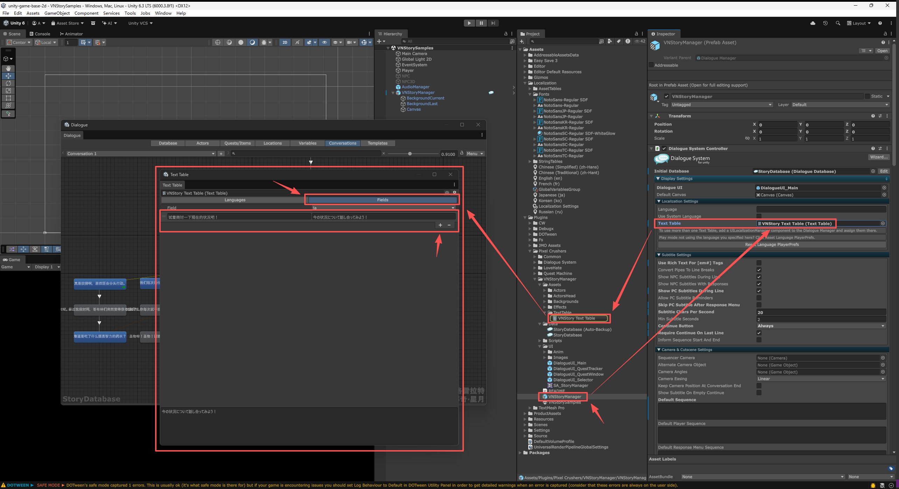

- 在 多语言文本表中，添加一个 提示消息的 多语言文本条目。
  - 打开 多语言文本表 的编辑器窗口。
    - 在 Project面板中，选中 VNStoryManager 预制体。
    - 在 Inspector面板中，找到 Text Table条目，点击右侧 已经配置的 多语言文本表，就能快速选中 多语言文本表 的资源文件。
    - 双击 Project面板 中选中的 多语言文本表 资源文件，打开 多语言文本表 的编辑器窗口。
  - 添加 一个新的 多语言文本条目。
    - 点击右上的 Fields页签，切换到 字段条目页面。
    - 点击右下的[+]按钮，添加一个新的 字段条目。
      - 点击[-]按钮，可以删除 最下方的 字段条目。
      - 拖拽条目左侧的[=]按钮，可以调整 条目的顺序。

    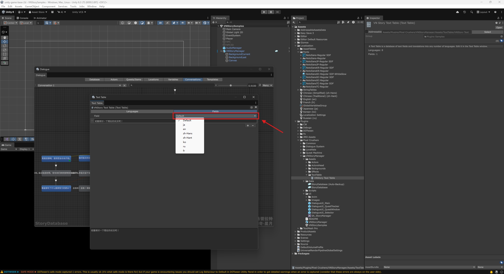
  - 配置 新的 多语言文本条目。
    - 字段标题：在条目左侧的 输入框中，填写 字段标题。作为 唯一标识 进行识别与查找。
      - 之前在 对话节点 上添加的 消息提示脚本行为 上输入的 消息提示文本内容(“试着商讨一下现在的状况吧！”)，会被直接作为 字段标题 来找到对应的 多语言文本条目。
      - 建议直接使用 提示消息的 对话文本，既可以保证 文本的唯一性，又可以方便地 查找与使用。
    - 文本内容：在条目右侧的 输入框中，填写 文本内容。
      - 点击 Fields页签下方的 下拉菜单，逐个切换语言类型 并输入 对应语言类型的 文本内容。
      - 剧情演出系统 会根据 玩家当前设定的 语言类型，自动切换到 对应语言类型的 文本内容 来进行显示。

## 更换头像

更换 对话框中的 头像图片。
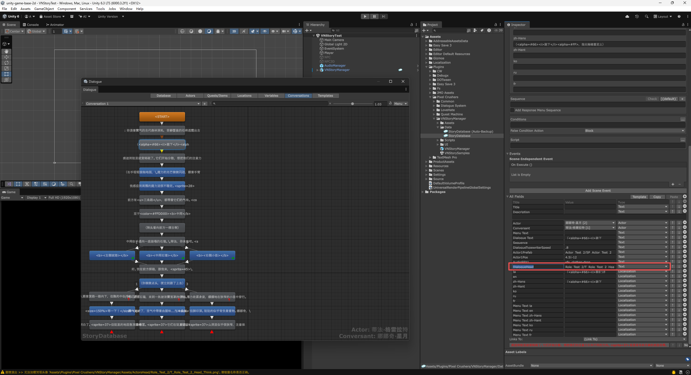

- 更换 当前说话角色的 对话框头像 图片。
  - 需要在 All Fields 中添加一个 字段条目，并将 Title(字段标题) 设置为 DialogueHead。Type(类型) 设置为 Text。
  - Value(内容值) 需要填写 头像图片的 相对路径。例如“Role_Test_2/T_Role_Test_2_Head_Think”，“Role_Test_2”是文件夹名称，后面用“/”分割开，最后的“T_Role_Test_2_Head_Think”是 头像图片的 文件名称。
  - 更换一次后 持续生效。还原操作 只能再次设置为 原来的头像图片。
  - Value(内容值)为空时，会清除 当前的头像图片。
  - 头像图片的资源文件夹，在 [文件路径与类型](#文件路径与类型) 进行指定。
  - 头像图片资源的 导入与设置 可以参考 [头像图片的导入](#角色头像图片的导入)

## 场景的背景

切换背景图片。
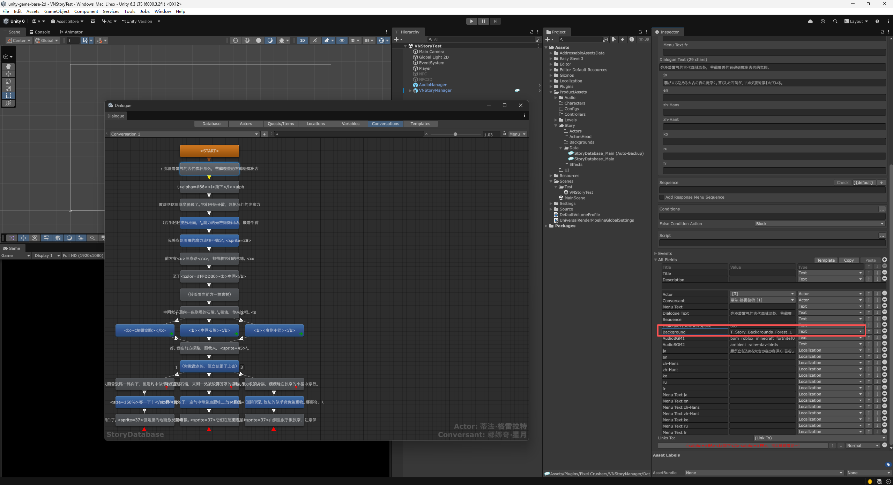

- 更换 当前场景的 背景图片。
  - 需要在 All Fields 中添加一个 字段条目，并将 Title(字段标题) 设置为 Background。Type(类型) 设置为 Text。
  - Value(内容值) 需要填写 背景图片的 相对路径。例如“T_Story_Backgrounds_Forest_1”，若放在文件夹中 则需要填写文件夹名称，后面用“/”分割开，最后的“T_Story_Backgrounds_Forest_1”是 背景图片的 文件名称。
  - 更换一次后 持续生效。还原操作 只能再次设置为 原来的背景图片。
  - Value(内容值)为空时，会清除 当前的背景图片。
  - 背景图片的资源文件夹，在 [文件路径与类型](#文件路径与类型) 进行指定。
  - 背景图片资源的 导入与设置 可以参考 [背景图片的导入](#背景图片的导入)

## 场景的角色

配置场景中的角色。设置角色的 位置、旋转、缩放、动画。\
实现简单的 位置移动、旋转、缩放变化的动画效果，并播放美术制作的 2D动画(Spine动画)。
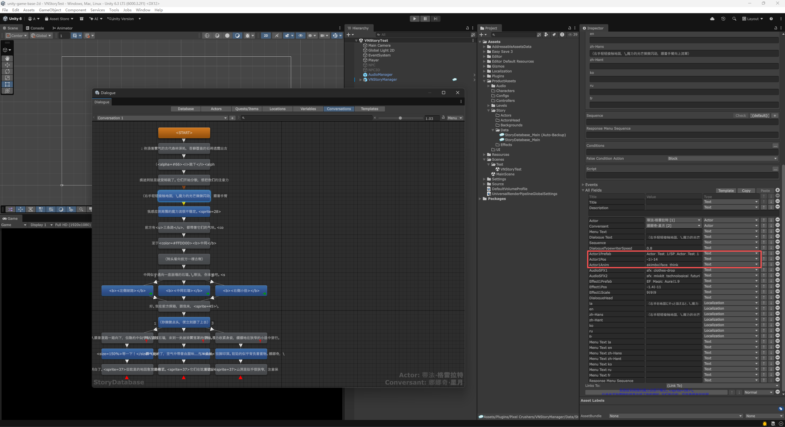

- 配置 当前场景的 出场角色。
  - 需要在 All Fields 中添加一个 字段条目，并将 Title(字段标题) 设置为 需要的名称。Type(类型) 设置为 Text。
  - Value(内容值) 需要按照 规定的格式进行填写。
  - 角色的资源文件夹，在 [文件路径与类型](#文件路径与类型) 进行指定。
  - 角色资源的 导入与设置 可以参考 [角色的导入](#角色的导入)
- 角色预制体。
  - Title(字段标题)：Actor1Prefab、Actor2Prefab、Actor3Prefab。可以在这3个槽位上 设置3个角色的预制体。
  - Value(内容值)：需要填写 角色预制体的 相对路径。例如“Actor_Test_1/SP_Actor_Test_1”，“Actor_Test_1”是文件夹名称，后面用“/”分割开，最后的“SP_Actor_Test_1”是 角色预制体的 文件名称。
  - 设置一次后 角色预制体会 持续存在。清空操作 只能再次将 Value(内容值) 设置为空。
  - Value(内容值)为空时，会清除 当前的角色预制体。
- 角色位置。
  - Title(字段标题)：Actor1Pos、Actor2Pos、Actor3Pos。分别对应 3个角色的预制体的 位置。
  - Value(内容值)：需要填写 “世界坐标X|世界坐标Y|世界坐标Z|移动速度倍率”，中间使用“|”分割开。例如“-1|-14|0|1.5”。
  - 默认 Value(内容值) 为“0|0|0|1.0”，可以按需要 只填写前几个位置的值，未填写的位置 会使用默认值。例如“1|-14”。
  - 世界坐标XYZ：分别代表 横向位置、纵向位置，前后位置(屏幕深度方向)。“0|0|0”的原点坐标 是 屏幕的正中心。本项目的 剧情演出系统 是2D的，因此 世界坐标Z 均设置为0即可。
  - 移动速度倍率：从之前的位置 移动到 现在的位置的速度。默认值是1.0。大于1.0则为加倍速，小于1.0则为减倍数。例如“2.0”两倍速度，“0.5”一半速度。
  - 设置一次后 角色位置 持续不变。还原操作 只能再次设置为 原来的 Value(内容值)。
- 角色旋转。
  - Title(字段标题)：Actor1Rotate、Actor2Rotate、Actor3Rotate。分别对应 3个角色的预制体的 旋转。
  - Value(内容值)：需要填写 “旋转角度X|旋转角度Y|旋转角度Z|旋转速度倍率”，中间使用“|”分割开。例如“-180|180|60|1.5”。
  - 默认 Value(内容值) 为“0|0|0|1.0”，可以按需要 只填写前几个位置的值，未填写的位置 会使用默认值。例如“-180”。
  - 旋转角度XYZ：分别代表 上下方向、左右方向，时针方向(绕中心)。“0|0|0”为无旋转。例如，左右朝向的翻转，可以将角度Y设置为180度。
  - 旋转速度倍率：从之前的旋转角度 变化到 现在的旋转角度。默认值是1.0。大于1.0则为加倍速，小于1.0则为减倍数。例如“2.0”两倍速度，“0.5”一半速度。
  - 设置一次后 角色旋转 持续不变。还原操作 只能再次设置为 原来的 Value(内容值)。
- 角色缩放。
  - Title(字段标题)：Actor1Scale、Actor2Scale、Actor3Scale。分别对应 3个角色的预制体的 缩放。
  - Value(内容值)：需要填写 “缩放倍率X|缩放倍率Y|缩放倍率Z|缩放速度倍率”，中间使用“|”分割开。例如“1.5|0.5|1|1.5”。
  - 默认 Value(内容值) 为“1|1|1|1.0”，可以按需要 只填写前几个位置的值，未填写的位置 会使用默认值。例如“1|0.5”。
  - 缩放倍率XYZ：分别代表 横向缩放、纵向缩放，前后缩放(屏幕深度方向)。“1|1|1”为标准1倍缩放。本项目的 剧情演出系统 是2D的，因此 缩放倍率Z 均设置为1即可。
  - 缩放速度倍率：从之前的缩放倍率 变化到 现在的缩放。默认值是1.0。大于1.0则为加倍速，小于1.0则为减倍数。例如“2.0”两倍速度，“0.5”一半速度。
  - 设置一次后 角色缩放 持续不变。还原操作 只能再次设置为 原来的 Value(内容值)。
- 角色动画。
  - Title(字段标题)：Actor1Anim、Actor2Anim、Actor3Anim。分别对应 3个角色的预制体的 动画。
  - Value(内容值)：需要填写 “动画Key1|动画Key2|动画Key3|...”，中间使用“|”分割开。例如“akimbo|face_think”。
  - 默认 Value(内容值) 为“”（空），可以按需填写多个动画，没有数量限制。未填写 则不会播放动画。
  - 动画Key：可以使用的动画Key，提前配置在 角色预制体 上。具体的配置方法，请参照 [角色的导入](#角色的导入)。
  - 设置一次后 角色动画 持续不变。还原操作 只能再次设置为 原来的 Value(内容值)。

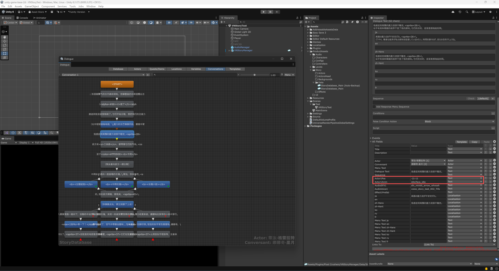

- 角色预制体 在设置一次后会 持续存在 于场景中。
  - 之后，仅需设置 角色位置、旋转、缩放、动画，就可以修改 已经存在的对应的 角色预制体。无需重复配置 角色预制体的 字段条目。
  - 如图所示，在上一个 对话节点 中，已经设置了 Actor1Prefab，这里仅输入了 Actor1Pos 来修改 角色预制体的位置。
  - 字段条目的配置方式 与 实际的剧情演出效果，可参考 [示例场景](#示例场景)。

## 场景的特效

配置场景中的特效。设置特效的 位置、旋转、缩放、动画。
实现简单的 位置移动、旋转、缩放变化的动画效果，并播放美术制作的 2D动画(Spine动画)。
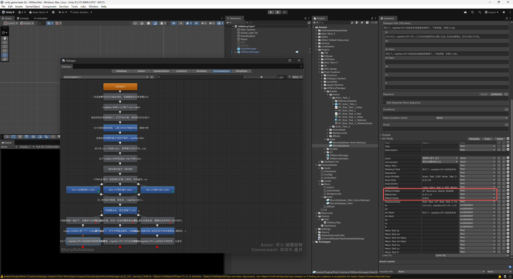

- 配置方式与 [场景的角色](#场景的角色) 相同，这里仅列出 字段条目 的名称。
  - 特效资源的 导入与设置 可以参考 [特效的导入](#特效的导入)
- 特效预制体。
  - Title(字段标题)：Effect1Prefab、Effect2Prefab、Effect3Prefab。可以在这3个槽位上 设置3个特效的预制体。
- 特效位置。
  - Title(字段标题)：Effect1Pos、Effect2Pos、Effect3Pos。分别对应 3个特效的预制体的 位置。
- 特效旋转。
  - Title(字段标题)：Effect1Rotate、Effect2Rotate、Effect3Rotate。分别对应 3个特效的预制体的 旋转。
- 特效缩放。
  - Title(字段标题)：Effect1Scale、Effect2Scale、Effect3Scale。分别对应 3个特效的预制体的 缩放。
- 特效动画。
  - Title(字段标题)：Effect1Anim、Effect2Anim、Effect3Anim。分别对应 3个特效的预制体的 动画。

## 场景的音频

背景音乐、环境音、特效音、语音的配置。
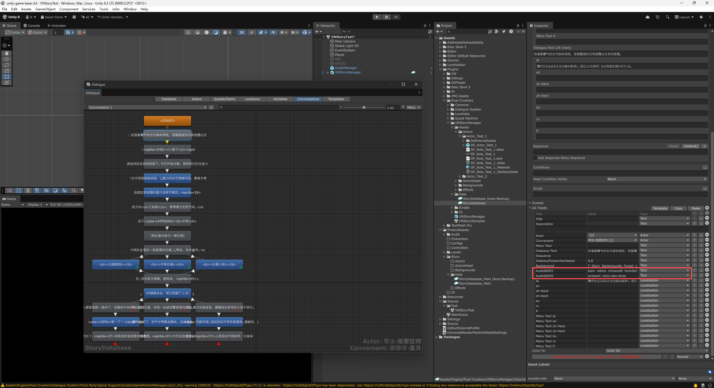

- 配置 当前场景的 音频。
  - 需要在 All Fields 中添加一个 字段条目，并将 Title(字段标题) 设置为 需要的名称。Type(类型) 设置为 Text。
  - Value(内容值) 需要填写 提前配置的 音频Key。配置方法 可以参考 [资源导入](#资源导入)
  - 角色的资源文件夹，在 [文件路径与类型](#文件路径与类型) 进行指定。
  - 音频资源的 导入与设置 可以参考 [音频的导入](#音频的导入)
- 背景音乐。
  - Title(字段标题)：AudioBGM1、AudioBGM2、AudioBGM3。可以同时播放 3个背景音乐。
  - 设置一次后 背景音乐 持续循环播放。还原操作 只能再次设置为 原来的 Value(内容值)。
  - Value(内容值)为空时，会清除 当前的背景音乐。
- 环境音。
  - Title(字段标题)：AudioAmbient1、AudioAmbient2、AudioAmbient3。可以同时播放 3个环境音。
  - 仅播放一次，不会循环持续播放。
  - 通常是 风声、鸟叫声、石头滚落声 等 周围环境的声音。
- 特效音。
  - Title(字段标题)：AudioSFX1、AudioSFX2、AudioSFX3。可以同时播放 3个特效音。
  - 仅播放一次，不会循环持续播放。
  - 通常是 爆炸声、魔法释放声、刀剑碰撞声 等 特殊的效果声音。
- 语音。
  - Title(字段标题)：AudioVoice1、AudioVoice2、AudioVoice3。可以同时播放 3个语音。
  - 仅播放一次，不会循环持续播放。
  - 通常是 角色说话、猴子喊叫 等 动物沟通的说话声音。
- Value(内容值)。
  - 音频的 Value(内容值) 配置格式相同。需要填写 “音频Key|音量|音调|延迟播放时间(秒)”，中间使用“|”分割开。例如“sfx_mixkit_air_woosh|1.5|1|4.7”。
  - 默认 Value(内容值) 为“音频Key|1|1|0”，可以按需要 只填写前几个位置的值，未填写的位置 会使用默认值。例如，仅填写“音频Key”。
  - 音频Key：可以使用的音频Key，提前配置在 音频Key列表 上。具体的配置方法，请参照 [音频的导入](#音频的导入)。
  - 音量：声音大小的倍率，默认值为1.0。最大为1.0，小于1.0 则声音变小。
  - 音调：音调速度的倍率，默认值为1.0。大于1.0 则音调升高 播放速度加快，小于1.0 则音调降低 播放速度减慢。

## 富文本符号

可以使用 富文本 的符号，来完成一些文本的 特殊效果。\
这里只列出常用的 富文本符号，想要了解全部的内容，可以参考[Unity官方文档](https://docs.unity.cn/Packages/com.unity.textmeshpro%404.0/manual/RichTextBoldItalic.html)。

| 符号 | 功能        |
| ---- | ---------- |
| \<b>\</b> | <b>加粗</b>  |
| \<i>\</i> | <i>斜体</i>  |
| \<u>\</u> | <u>下划线</u>。在文字底部 横向划线。 |
| \<s>\</s> | <s>删除线</s>。在文字中间 横向划线。 |
| \\ | 上标显示。将文字显示在 上方。 |
| \\ | 下标显示。将文字显示在 下方。 |
| \<size=150%>\</size> | 缩放。标准大小为100%，对文字进行放大或缩小。 |
| \<rotate="-10">\</rotate> | 旋转。正数为顺时针，负数为逆时针。  |
| \<alpha=#66>\<alpha=#FF>   | 透明度。在“=#”后面输入 十六进制(0~F)的 2位数值。无需使用结束符号\</alpha>进行包裹，在符号之后的 文字的透明度 都会被修改，如果想 恢复透明度，再次使用\<alpha=#FF>就可以了。|
| \<color=#0055AA>\</color>   | 颜色。在“=#”后面输入 十六进制(0~F)的 6位数值，每2位分别代表R(Red)G(Green)B(Blue)的数值。另外 还可以再输入2位数值，代表A(Alpha)透明度的数值。例如“FF000088” |
| \<mark=#FFFF00AA>\</mark>   | 类似记号笔的颜色块覆盖在文字上的效果。在“=#”后面输入 十六进制(0~F)的 8位数值。为了达到文字被覆盖，但任然看得到文字的效果，最后2位 透明度值，通常不会是最大的“FF” |
| \<sprite=3> | 图标。在文字中间插入图标，“=”后面输入的是符号的 序号，序号从0开始。图标的序号与自定义，请查看 [富文本图标的导入](#富文本图标的导入) |
| \<sprite name="wink"> | 图标。在文字中间插入图标，也可以使用 预先设定好的名称 来指定图标。 |

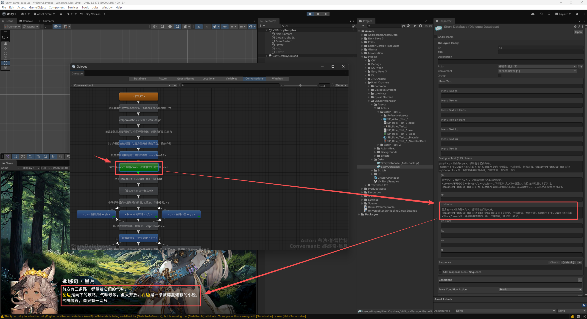

- 例如 “他的\<b>力量值\</b>很高” 使用 “\<b>\</b>” 将 “力量值”包起来，就可以加粗字体。
  - 另外，可以使用 多个符号 进行多重包裹。例如 \<color=#FFDD00>\<b>力量值\</b>\</color> 在加粗的同时 还修改了颜色。
- 富文本的书写方式 与 实际的剧情演出效果，可参考 [示例场景](#示例场景)。

### 「打字机符号」

调整文本打字机的播放效果。\
例如 “你好\\.请问你叫什么名字” 在“你好”之后输入“\\.”符号，就会在这里停顿1.0秒，再继续之后的 文本打字机效果。

另外，文本中的“。”会自动停顿1秒，“，”会自动停顿0.3秒。

| 符号 | 功能         |
| ---- | ----------- |
| \\.   | 停顿1.0秒   |
| \\,   | 停顿0.3秒   |
| \\^   | 直接跳到最后 |

## 多语言条目

所有文本 都需要填写 不同语言的文本。在游戏 切换显示语言时，所有的文本也会 切换成 对应的语言文本。\
多语言 字段条目 的格式，通常是 [字段条目标题]+[语言代码]。

| 语言代码 | 详情               |
| ------- | ------------------ |
| ja      | Japanese (ja) 日语 |
| en      | English (en) 英语 |
| zh-Hans | Chinese (Simplified) (zh-Hans) 中文-简体 |
| zh-Hant | Chinese (Traditional) (zh-Hant) 中文-繁体 |
| ko      | Korean (ko) 韩语 |
| ru      | Russian (ru) 俄罗斯语 |
| fr      | French (fr) 法语 |

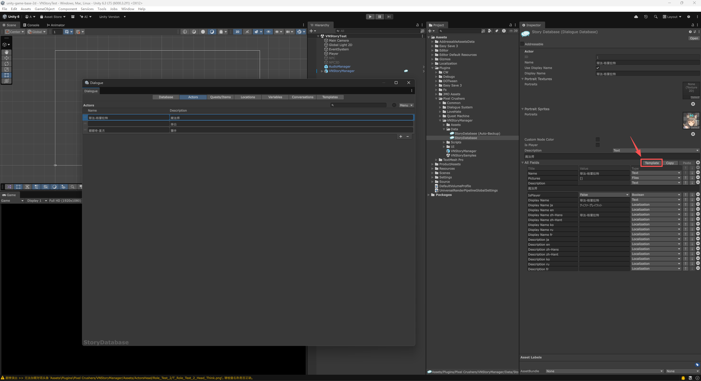

- 需要填写多语言文本的，一般有 角色名称、角色描述、对话文本、选择节点的标题。
  - 多语言需要的 字段条目，已经配置在了 Templates 页面中，如果缺失了一些 多语言 字段条目，可以点击 All Fields 右侧的[Template]按钮，就会从已经配置的 Template 中 将缺失的 字段条目 自动补充上去。

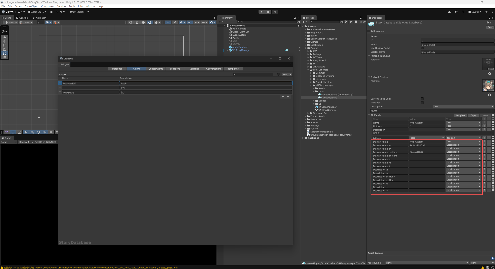

- 角色名称
  - Display Name：默认的 角色显示名称。找不到对应语言的 文本内容时，就会使用这个 默认的文本内容。
  - Display Name [语言代码]：对应语言的 角色显示名称。
- 角色描述
  - Description：默认的 角色描述。找不到对应语言的 文本内容时，就会使用这个 默认的文本内容。
  - Description [语言代码]：对应语言的 角色描述。

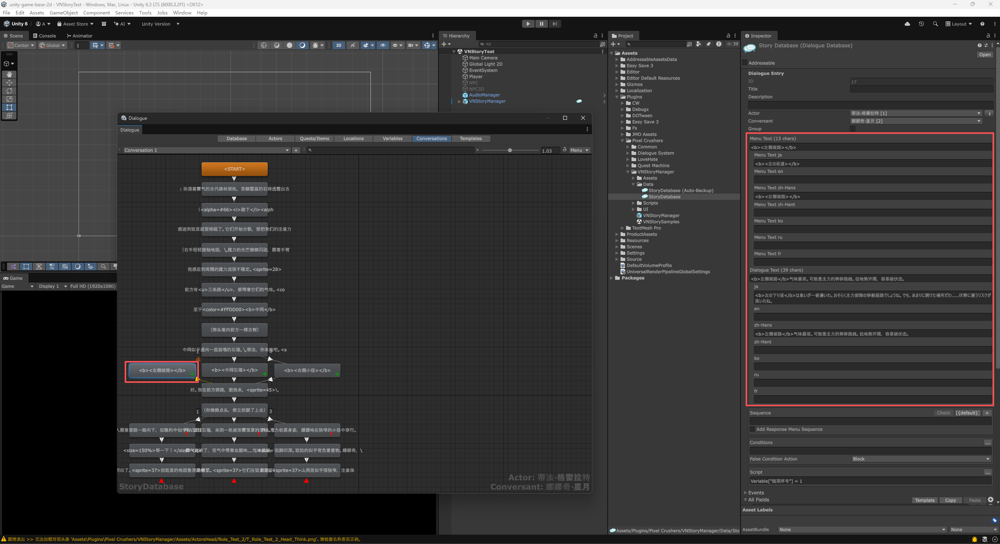

- 对话文本
  - Dialogue Text：对话文本。默认文本。找不到对应语言的 文本内容时，就会使用这个 默认的文本内容。
  - [语言代码]：对应语言的 对话文本。特例，对话文本的 多语言字段条目，直接以 [语言代码] 的形式进行命名。
- 节点标题
  - Menu Text：分支选项的 节点标题。默认文本。找不到对应语言的 文本内容时，就会使用这个 默认的文本内容。
  - Menu Text [语言代码]：对应语言的 分支选项的 节点标题。

# UI样式

剧情演出系统的UI样式，可以根据美术设计的需求，进行自定义的修改。
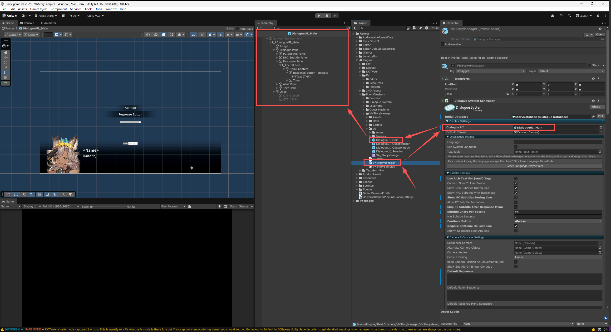

- 在 Project面板中，选中 VNStoryManager预制体。
  - 在右侧的 Inspector面板中，找到 Dialogue System Controller组件。
  - 找到 Dialogue UI 条目，点击右侧 当前的 UI预制体，就可以在 Project面板中 定位到 当前的 UI预制体了。
- 建议复制 当前的 UI预制体，创建一个新的 UI预制体。
  - 如果还有 Animator组件来制作 UI动画，则建议将 Animator组件所使用的 Animator Controller、Animation Clip等资源也一起复制，不要修改 旧的UI预制体使用的 Animator Controller 与 Animation Clip，以免影响到 旧的UI预制体的 UI动画效果。
  - 将新的 UI预制体 的名称 修改为 具有辨识度的名称，以便于区分。
  - 将新的 UI预制体 拖拽到 Dialogue System Controller组件 的 Dialogue UI 条目上，替换掉 当前的 UI预制体。

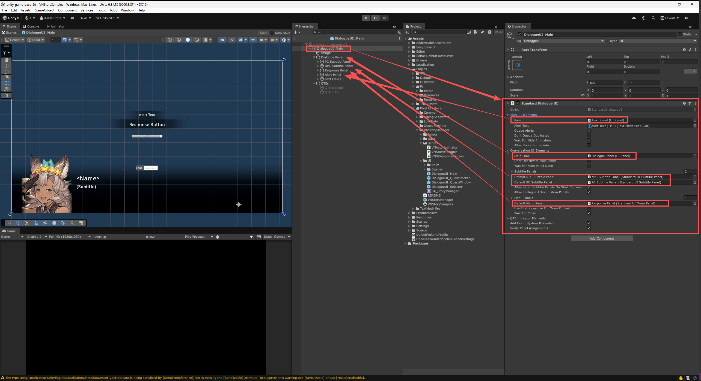

- 修改新的 UI预制体 来实现 UI样式的自定义。
  - Standard Dialogue UI 是 剧情演出系统UI的核心组件。通常会直接挂载到 UI预制体的根物体上。
  - 剧情演出系统的UI，主要由 PC Subtitle Panel(玩家对话面板)、NPC Subtitle Panel(配角对话面板)、Response Panel(分支选项面板)、Alert Panel(消息面板) 这4个部分组成。
  - Text Field UI(文本输入面板) 暂时没有启用。
  - Alert Text：消息文本组件。提示的文本组件，显示一些提示信息，例如“存档成功”、“好感度提升了”等等。可直接修改 排版、位置、字体等属性。
  - 这里只列出一些 常用的 UI元素，想要了解更加详细的内容，可以参考 [官方教程](#官方教程)。

## UI玩家对话面板 与 UI配角对话面板

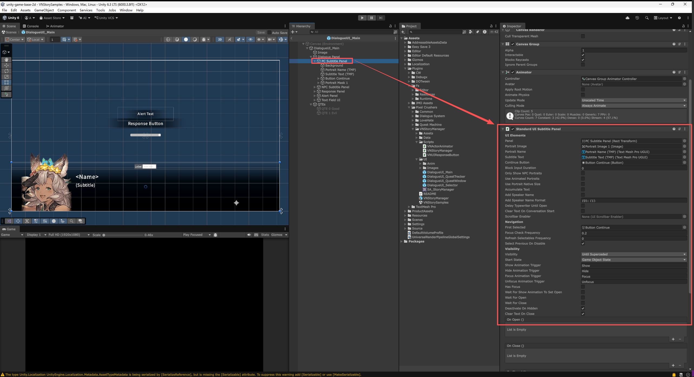

- Standard UI Subtitle Panel：玩家对话面板 与 配角对话面板 的 核心组件。
  - 组件上的 条目，一般都不需要替换，点击条目右侧 已经设置好的 UI元素，就可以在 Hierarchy面板中 选中 UI元素，直接进行修改。
  - Panel：面板主体的RectTransform组件。可不修改。
  - Portrait Image：头像图片组件。直接修改图片的 排版、大小、位置 即可。
  - Portrait Name：名称文本组件。直接修改文本组件的 属性、排版、位置 即可。
  - Subtitle Text：对话文本组件。直接修改文本组件的 属性、排版、位置 即可。
  - Continue Button：继续按钮组件。直接修改按钮组件的 属性、排版、位置 即可。
    - 一般会将 可点击区域 覆盖全屏，以便于玩家 点击屏幕的 任意位置 来继续剧情。
  - Panel下用于装饰等作用的其他 UI元素。可以根据需要 修改、删除、添加等。
    - 所有的 UI元素，都会受到 Standard UI Subtitle Panel 的统一控制，例如 淡入、淡出、位移 等效果。
    - 图示中的 Background 是对话框底部的 背景装饰图片。

## UI分支选项面板

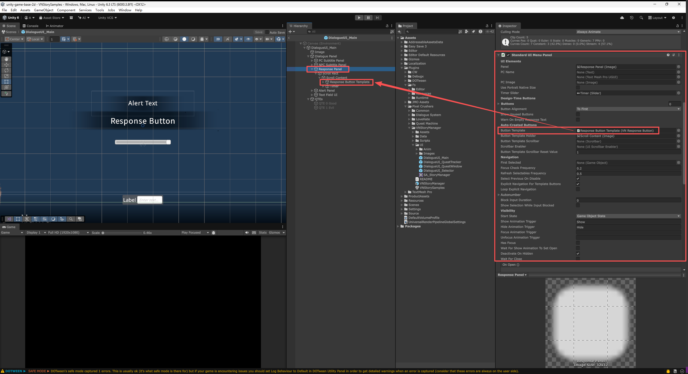

- Standard UI Menu Panel：分支选项面板的 核心组件。
  - Panel：背景底板的Image组件。可以修改背景底板的图片、颜色等属性。
    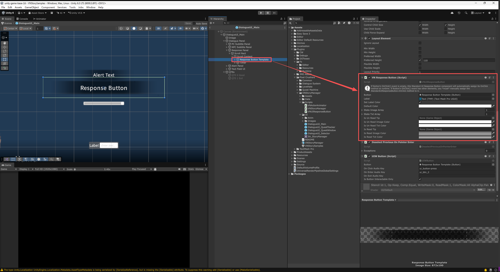
  - Button Template：分支选项按钮的 模板。可以修改按钮的图片、颜色、文本样式等属性。
    - Button：按钮组件。一般不需要替换，直接修改 按钮组件的属性、排版 即可。
    - Label：按钮上的文本组件。一般不需要替换，直接修改 文本组件的属性、排版 即可。
    - State Image Array：状态图片组件 数组，可以配置多个图片。根据 不同状态(未读、已读 等) 修改 图片的显示效果。
    - State Txt Array：状态文本组件 数组，可以配置多个文本。根据 不同状态(未读、已读 等) 修改 文本的显示效果。
    - Is Un Read Tip：未读状态 的 提示物体。根据 不同状态 设置提示对象的显示或隐藏。
    - Is Un Read Image Color：未读状态 的 图片颜色。根据 不同状态 设置图片的颜色。
    - Is Un Read Txt Color：未读状态 的 文本颜色。根据 不同状态 设置文本的颜色。
    - Is Read Tip：已读状态 的 提示物体。根据 不同状态 设置提示对象的显示或隐藏。
    - Is Read Image Color：已读状态 的 图片颜色。根据 不同状态 设置图片的颜色。
    - Is Read Txt Color：已读状态 的 文本颜色。根据 不同状态 设置文本的颜色。

## UI消息面板

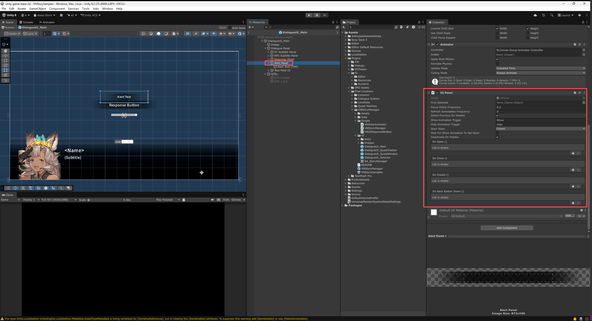

- UI Panel：通用的 基础面板组件，没有什么额外的功能。
  - 子物体Alert Text：消息文本组件。直接修改文本组件的 属性、排版、位置 即可。
  - Panel下用于装饰等作用的其他 UI元素。可以根据需要 修改、删除、添加等。
    - 所有的 UI元素，都会受到 UI Panel 的统一控制，例如 淡入、淡出、位移 等效果。
    - 可以自行添加 背景图片、装饰图片等。

## UI动画

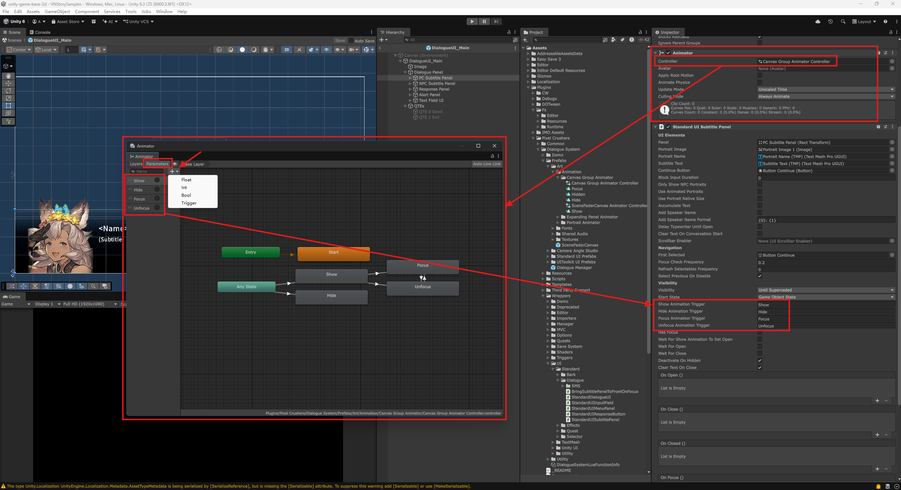

- 使用 Animator组件 来制作 UI动画。
  - 可以在 UI预制体 的 根物体上，添加 Animator组件 来制作 UI动画。
    - 建议与 UI Panel 或 Standard UI Subtitle Panel 等组件，在同一个 物体上。
    - 例如，可以制作 UI面板的 淡入淡出动画。
  - 在 Animator面板中，使用 Parameters(参数) 来作为动画动态的 切换条件。
    - 双击 Animator组件 上的 Controller(控制器)条目右侧 当前的 Animator Controller，就可以快速打开 Animator面板 进行编辑。
    - 点击 Animator 面板 左上角的 Parameters页签，就可以进入参数页面。
    - 点击 Parameters页面 右上角的[+]按钮，添加 Trigger(触发器)类型的参数。
    - 根据 UI Panel 等组件的功能支持，添加对应的 Trigger参数。
      - 可自由命名。例如“Show”、“Hide”、“Focus”、“Unfocus”。
  - 在 UI Panel 等组件上，配置 Trigger参数的名称。
    - Show Animation Trigger：显示动画的触发器。配置 Trigger参数 的名称，例如“Show”。
    - Hide Animation Trigger：隐藏动画的触发器。配置 Trigger参数 的名称，例如“Hide”。
    - Focus Animation Trigger：聚焦动画的触发器。配置 Trigger参数 的名称，例如“Focus”。
    - Unfocus Animation Trigger：失焦动画的触发器。配置 Trigger参数 的名称，例如“Unfocus”。

# 功能示例

## 阅读所有选项

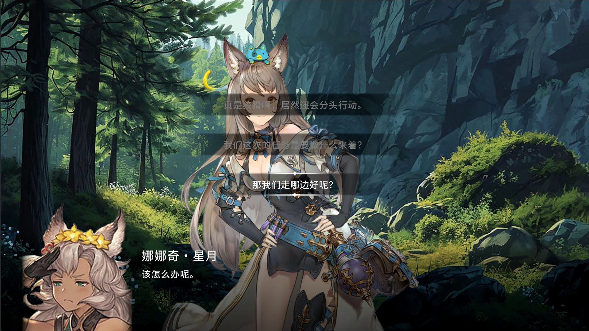
当需要玩家 阅读所有的 分支选项 后，才能进入后续剧情时，可以按照以下方式 进行配置。
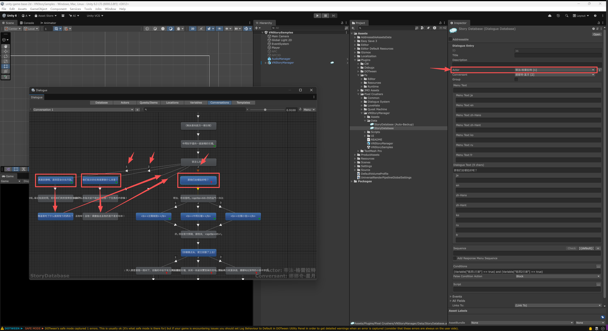

- 添加多个 分支选项。
  - 选定一个节点 作为 开始节点，后续添加多个 后续节点，形成 分支选项。
    - 所有的 后续节点，都需要在右侧的 Inspector面板 中，将 Actor(说话角色) 设置为 玩家。
    - 有多个 后续节点时，可以看到在 链接 上会显示 数字1、2、3，代表了 分支选项的序号。
  - 前面的 1、2号 分支节点，在自己的 后续对话节点 结束后，需要 链接回 开始节点，形成一个循环。
    - 这样就可以使 玩家在选择了 1、2号 分支选项 之后，都会回到 开始节点，可以继续选择 其他分支选项。
  - 最后一个 3号 分支节点，后续对话节点 则是 进入后续的 主线剧情的节点上。
    - 这样就可以使 玩家在选择了 3号 分支选项 之后，才会进入后续的 主线剧情。

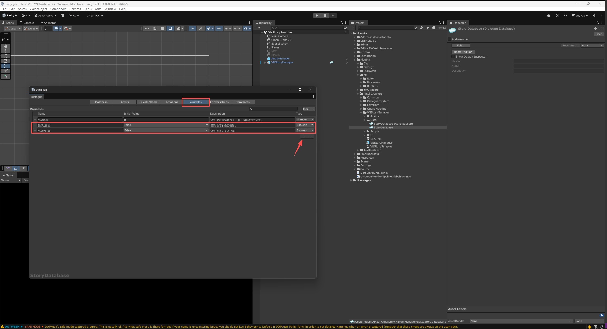-

- 创建 分支选项是否已读 的 全局变量。
  - 全局变量 是在 Dialogue System 中 任何对话节点 都可以访问到的 变量。
    - 使用 全局变量 来记录 玩家是否 阅读过了 分支选项。
    - 通过判断 全局变量 的值 来知道 玩家是否 阅读过了所有的 分支选项，从而决定 是否显示出最后一个 可以进入后续主线剧情的 分支选项。
  - 点击Dialogue窗口 上方的 Variables页签，进入 全局变量页面。
  - 点击右下的[+]按钮，就可以添加一个 变量条目。
    - Name：变量名称。可随意按照 命名规范进行命名，例如“选项1已读”、“选项2已读”。
    - Initial Value：初始内容值。默认设置为 False，代表未读。
    - Description：描述。**<非必须>**。仅作为 备注。
    - Type：变量类型。设置为 Boolean(布尔)，代表 该变量的内容值 只能是 True 或 False。

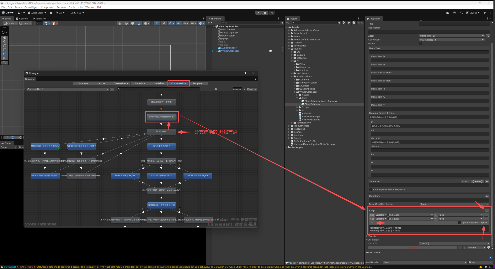

- 重置 选项是否已读 的 全局变量。
  - 点击Dialogue窗口 上方的 Conversations页签，回到 对话节点页面。
  - 选中 分支选项的 开始节点的 上一个对话节点，在右侧的 Inspector面板 中，找到 Script(执行脚本)。
    - 因为 开始节点 会被 1、2号 分支选项 循环链接回去，所以 开始节点的 脚本行为会被 反复执行。
    - 但是 我们只需要对所有的 选项是否已读 的 全局变量，进行一次 重置操作。如果被反复重置，就无法记录 玩家是否 阅读过了 分支选项了。
  - 将所有的 选项是否已读 的 全局变量 的值 重置为 False。
    - 点击右侧的[...]按钮，打开 添加 脚本行为菜单。
    - 点击菜单 最左侧的[+]按钮，就可以添加1个 脚本行为。
    - 行为类型：选择 Variable(变量)，代表要修改一个变量的值。
    - 变量名称：选择要修改的 变量名称，例如“选项1已读”、“选项2已读”。
    - 设置类型：只有 to(设置为) 这一种设置类型。无需修改。
    - 目标值：设置为 False。
  - 应用 配置好的 脚本行为。
    - 点击 右下角的 [Apply]按钮，就可以将 脚本行为 应用到 对话节点 上了。
    - Append：是否 附加到现有的 脚本行为之后。
      - √勾选时，脚本行为菜单 中配置的 脚本行为 会附加到 现有的 脚本行为上。
      - 不勾选时，会清空现有的 脚本行为 只使用现在 脚本行为菜单 中配置的 脚本行为。
    - Revert：复原按钮。取消本次 脚本行为菜单 的配置，保持原来的 脚本行为。
  - 自动生成 脚本行为代码。
    - 应用后，在 Script(执行脚本)文本框中，就会自动生成 脚本行为的 Lua代码了。
    - 例如，设置了“选项1已读”这个变量的值 设置为 False，那么就会生成如下的 Lua代码：`Variable["选项1已读"] = false`。

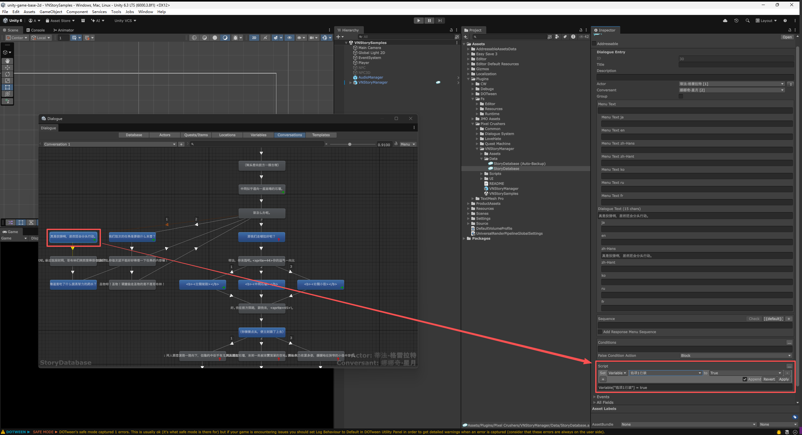

- 记录 已读分支选项 的 全局变量。
  - 选中 1号 分支节点，在右侧的 Inspector面板 中，找到 Script(执行脚本)。
  - 配置 脚本行为 来将“选项1已读”这个全局变量 的值 设置为 True。
  - 同样的方式，在 2号 分支节点 上 配置 脚本行为 来将“选项2已读”这个全局变量 的值 设置为 True。

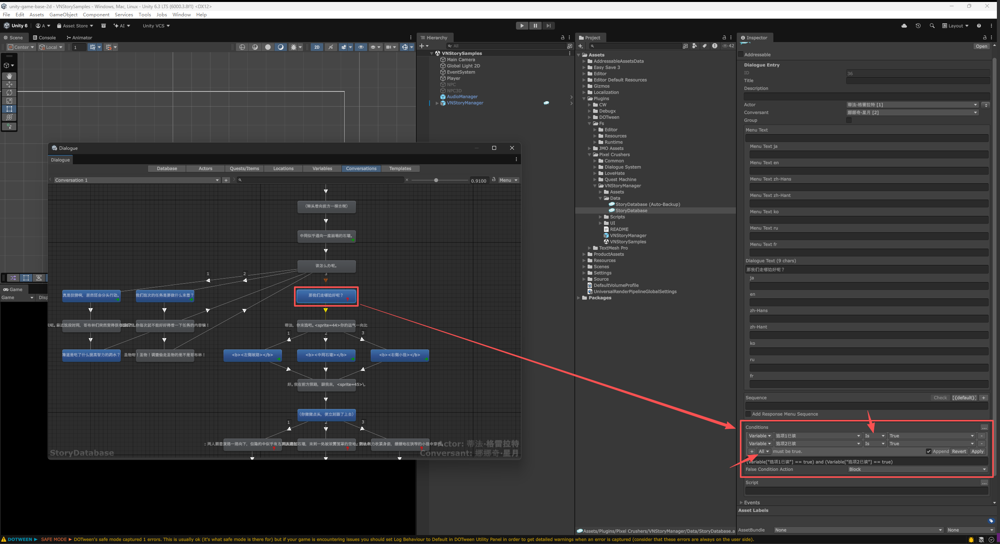

- 判断 所有的分支选项 是否已读。
  - 选中 3号 分支节点，在右侧的 Inspector面板 中，找到 Conditions(条件列表)。
  - 点击右侧的[...]按钮，打开 添加 条件菜单。
  - 点击菜单 最左侧的[+]按钮，就可以添加1个 条件。
    - 条件类型：选择 Variable(变量)，代表要判断一个变量的值。
    - 变量名称：选择要判断的 变量名称，例如“选项1已读”、“选项2已读”。
    - 判断方式：选择 Is(是)。当变量的值 “是 True”的时候，条件就满足了。
      - Is Not：不是，反向的判断方式。当变量的值 “不是 True”的时候，条件就满足了。
    - 内容值：设置为 True。
  - 左下角的 条件满足类型 设置为 全部。
    - All：全部。所有的条件都满足了，才满足进入条件。
    - Any：任意。满足了任意一个条件，就满足进入条件。
  - 应用 配置好的 条件。
    - 点击 右下角的 [Apply]按钮，就可以将 条件 应用到 对话节点 上了。
  - 自动生成 条件代码。
    - 应用后，在 Conditions(条件列表)文本框中，就会自动生成 条件的 Lua代码了。
    - 例如，设置了“选项1已读”这个变量的值 设置为 True，那么就会生成如下的 Lua代码：`Variable["选项1已读"] == true`。
    - 多个条件 会使用“()”包裹起来，并使用 and 或 or 连接起来。
      - 条件满足类型 设置为 All时，使用 and 连接。
      - 条件满足类型 设置为 Any时，使用 or 连接。

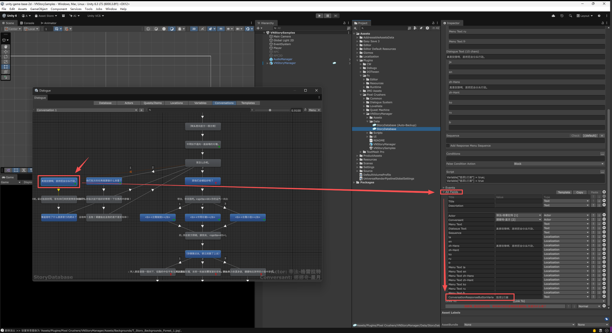

- 在 UI的 分支选项按钮上，显示 已读的标记。
  - 在 1、2号 分支节点 的 All Fields中，添加一个 变量条目。
    - Title(字段标题)：必须设置为 “ConversationResponseButtonVariableIsRead”。
    - Value(内容值)：设置为这个 分支节点 使用的 全局变量的名称，例如“选项1已读”、“选项2已读”。
    - Type(类型)：设置为 Text。
  - 之后，在 游戏的剧情演出中，UI系统的 分支选项按钮，就会根据 是否已读 来改变UI的显示效果了。
    - 分支选项按钮，会自动读取 ConversationResponseButtonVariableIsRead 这个字段的内容值，来知道要读取哪个 全局变量的值。

- 测试 剧情演出中的 分支选项。
  - 可以在 示例场景 中，进行测试。
    - 测试的方法，可以参考 [快速入门](#快速入门) 教程中的 测试部分。
  - 可以看到 已读的分支选项的 按钮UI，会显示为灰色。
    - 未读的分支选项的 按钮UI，会显示为白色。
    - UI样式与颜色的修改，可以参考 [UI分支选项](#ui分支选项面板) 的教程。
    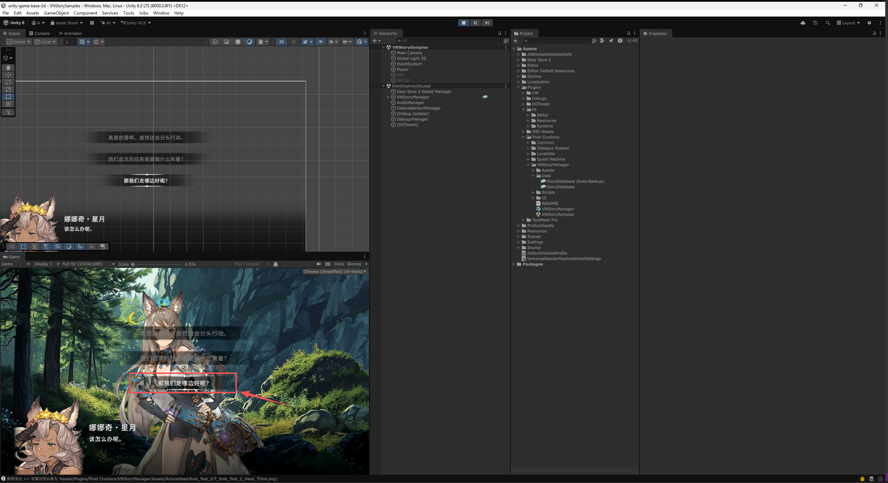
  - 当玩家 阅读了 1、2号 分支选项 后，才会出现 3号 分支选项，之后才能够进入后续的 主线剧情。
