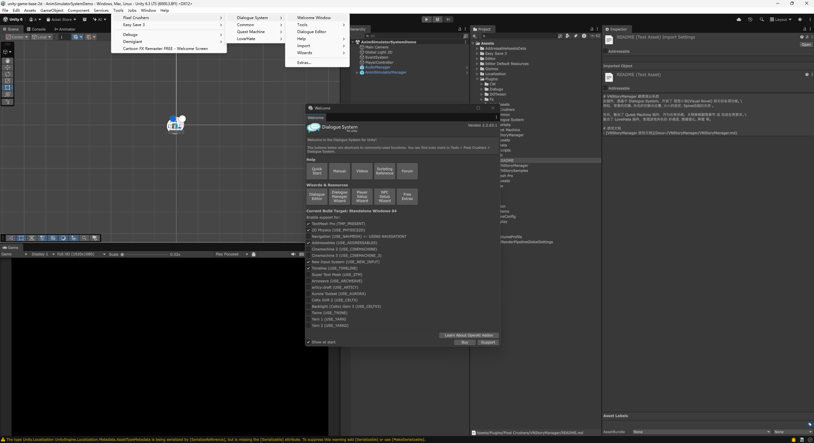

<p align="center">
  
  
  
  
  
  
</p>

<p align="center">
  📥
  <a href="#-安装">安装</a> |
  <a href="#-快速开始">快速开始</a> |
  <a href="Packages/com.ale.vnframework/README.md">详细文档</a>
</p>

# Ale VN Framework - 剧情演出框架

Ale VN Framework 是一款面向 `Unity` 的**视觉小说（Visual Novel / Galgame）剧情演出插件**，
建立在 [Pixel Crushers Dialogue System](https://assetstore.unity.com/packages/tools/behavior-ai/dialogue-system-for-unity-11672) 之上。
Dialogue System 负责**对话数据、分支逻辑与 Lua 环境**，本插件补齐它没有覆盖的**演出层**——
背景 / 角色 / 特效 / 头像的切换与补间、消息提示、富文本符号、多语言条目、自动播放与跳过。

演出**不写代码**：在 Dialogue System 对话节点的**字段条目（Fields）**里填参数即可驱动，
策划在 Dialogue 编辑器窗口内就能完成整段剧情的配置。

角色动画经 `VnActorAnimator` 对接 [`com.ale.animsimulatorsystem`](https://github.com/AleFeng/unity-ale-anim-simulator)，
**后端无关**——Spine / Live2D / Unity 动画走同一套接口；没有 `VnActorAnimator` 组件的纯图片、
纯粒子预制体也按同一套流程实例化与销毁。

## 📜 目录
- [Ale VN Framework - 剧情演出框架](#ale-vn-framework---剧情演出框架)
  - [📜 目录](#-目录)
  - [简介](#简介)
    - [项目特性](#项目特性)
    - [核心组件](#核心组件)
  - [💻 环境要求](#-环境要求)
  - [📦 安装](#-安装)
    - [⚠ 前置条件：为 Dialogue System 补 Assembly Definitions](#-前置条件为-dialogue-system-补-assembly-definitions)
    - [使用 UPM（推荐）](#使用-upm推荐)
    - [导入演示 Sample（可选）](#导入演示-sample可选)
    - [其他方式](#其他方式)
  - [🚀 快速开始](#-快速开始)
    - [1. 准备剧情数据文件](#1-准备剧情数据文件)
    - [2. 放置剧情演出管理器](#2-放置剧情演出管理器)
    - [3. 按目录导入美术资源](#3-按目录导入美术资源)
    - [4. 在对话节点上配置演出](#4-在对话节点上配置演出)
    - [5. 触发播放](#5-触发播放)
  - [🖥️ 欢迎窗口](#️-欢迎窗口)
  - [🖥️ 基础设置](#️-基础设置)
  - [🧩 可选宏开关](#-可选宏开关)
  - [📖 详细文档](#-详细文档)
  - [📁 目录结构](#-目录结构)
  - [📋 待办事项](#-待办事项)
  - [📄 许可](#-许可)

## 简介

Dialogue System 把「说什么、跳到哪」解决得很好，但「这句话时背景换成什么、谁站在哪、播什么动画、
出什么特效」通常要各家自己写一遍。Ale VN Framework 把这套演出层收拢成**可配置的数据**：

1. **演出即数据** —— 背景、角色、位置 / 旋转 / 缩放、动画、特效、头像、音频，全部由对话节点上的
   **字段条目**驱动，值是 `|` 分隔的参数串（如 `0|-3|0|1.5`）。字段条目的标题可在管理器上改，
   同类条目（角色、特效）可增删多份以支持同屏多个。
2. **资源按目录约定加载** —— 背景 / 角色 / 头像 / 特效各配一个文件夹路径与扩展名，
   配置里只写资源名；开启 `ATK_ADDRESSABLE` 时经 Addressables 异步加载，否则回落 `Resources`。
3. **动画后端无关** —— 演出层只认 `AnimatorBase`，Spine / Live2D / Unity 动画同一套接口；
   没有动画组件的纯图片、纯粒子预制体也走同一套加载与销毁流程，不会残留实例或泄漏句柄。
4. **对外留了扩展点** —— `RegisterGameplaySystem` 按字段标题接管自定义玩法回调，
   `RegisterVariableGetter` 把宿主变量同步进 Dialogue System 的 Lua 环境。

### 项目特性
| 特性 | 描述 |
| --- | --- |
| 演出零代码配置 | 背景 / 角色 / 特效 / 头像 / 音频全部由对话节点的**字段条目**驱动；字段标题可自定义，角色与特效条目可 `[+] [-]` 增删以支持同屏多个。 |
| 位姿与补间 | 角色 / 特效各支持位置、旋转、缩放三组条目，值格式 `[X\|Y\|Z\|速度倍率]`，速度倍率控制补间快慢；背景切换支持淡入淡出时长配置。 |
| 动画后端无关 | 经 `com.ale.animsimulatorsystem` 的 `AnimatorBase` 抽象，Spine / Live2D / Unity 动画同一套接口；动画条目值格式 `[动画Key1\|动画Key2\|…]`。 |
| 无动画组件降级 | 纯图片、纯粒子（自动播放）预制体不挂 `VnActorAnimator` 也能正常实例化与销毁；粒子按最大生命期延迟回收，不残留实例、不泄漏 Addressable 句柄。 |
| 分支选项已读态 | `VnResponseButton` 按「是否已读」切换文本颜色、按钮颜色、提示对象显示与图片颜色，配合内置示例可实现「阅读所有选项」。 |
| 富文本与打字机 | 支持富文本图标符号与打字机符号，逐字显示过程中可插入停顿、表情图标等。 |
| 多语言条目 | 开启 `ATK_LOCALIZATION` 后，Unity Localization 选中的语言代码同步给 Dialogue System，由它按语言取对白与角色名；批量翻译用 DS 自带的 CSV 导出 / 导入。 |
| 自动播放与跳过 | `VnStoryPlayer` 可在 Inspector 配置对话名与自动播放时机（`AutoPlayTiming`），也可由 `Button.OnClick` 或脚本触发。 |
| 资源加载可选 Addressables | 经 `ToolkitAssets` 统一入口：开启 `ATK_ADDRESSABLE` 走 Addressables 异步加载与句柄回收，否则回落 `Resources`。 |
| 玩法系统扩展点 | `RegisterGameplaySystem(fieldTitle, callback)` 让任意自定义系统按字段标题接管演出流程；`RegisterVariableGetter` 同步宿主变量到 Lua。 |

### 核心组件
| 组件 | 职责 |
| --- | --- |
| **`VnStoryManager`** | 演出核心单例。解析对话节点字段条目，驱动背景 / 角色 / 特效 / 头像 / 消息，管理预制体加载与卸载、全局变量与扩展点。 |
| **`VnStoryPlayer`** | 播放控制。按对话名启停剧情，可配自动播放时机，或由 UI / 脚本触发。 |
| **`VnActorAnimator`** | 角色动画对接层。把演出层的播放 / 状态 / 皮肤请求转给 `AnimatorBase`，全部经就绪门控，不依赖帧序。 |
| **`VnResponseButton`** | 分支选项按钮。派生自 Dialogue System 的 `StandardUIResponseButton`，附加已读 / 未读态表现。 |
| **`VnStoryAudio`** | 音频接缝。按通道播放 BGM、按 Key 播放环境音 / 音效 / 语音；默认为空实现，见[可选宏开关](#-可选宏开关)。 |

> 每个组件的完整配置与使用流程见[详细文档](#-详细文档)。

## 💻 环境要求
- `Unity 2022.3` 或更新版本（`package.json` 声明的最低版本；本仓库基于 `Unity 6000.3` 开发与维护）。
- **Pixel Crushers Dialogue System**（Asset Store 付费资产，必需）——并且**必须先为它补上 Assembly
  Definitions**，见下节。
- 通用底层 [`com.ale.toolkit`](https://github.com/AleFeng/unity-ale-toolkit) 与动画系统
  [`com.ale.animsimulatorsystem`](https://github.com/AleFeng/unity-ale-anim-simulator)，均需**先装**。
- TextMeshPro / Unity Localization / Addressables 通过编译宏**可选**启用（见[可选宏开关](#-可选宏开关)）。

## 📦 安装

### ⚠ 前置条件：为 Dialogue System 补 Assembly Definitions

**这一步不做，本插件编译不过。**

本插件是 UPM 包，代码位于独立程序集 `Ale.VnFramework`。而 asmdef 程序集**无法引用预定义程序集
`Assembly-CSharp`**——Dialogue System 默认没有 asmdef，它的代码正落在那里，于是从包里看不见
`DialogueManager`、`StandardUIResponseButton` 这些类型，会报一片 `CS0246`。

Pixel Crushers 官方提供了 asmdef 方案（见其 `Dialogue System/Scripts/_README.txt`）。本插件在
**[`Docs~/Setup/PixelCrushers/`](Packages/com.ale.vnframework/Docs~/Setup/PixelCrushers/README.md)**
附了一份整理好的副本：6 个 `.asmdef` 已按目标相对路径摆放，整体复制到你的 `Pixel Crushers/` 目录即可。
其中第 6 个是**修官方遗漏的补丁**（官方布局会把 3 个纯编辑器模板脚本卷进运行时程序集，
**编辑器里编译不报错、只在出包时失败**）。逐条说明见该目录下的 README。

> 由于 Dialogue System 是付费资产、通常不进版本库，直接加在插件目录里的 asmdef 提交不到仓库、
> 且会被插件升级覆盖。重装或升级 Dialogue System 之后，照着上述文档再复制一次即可。

### 使用 UPM（推荐）

> ⚠️ **本插件依赖 [`com.ale.toolkit`](https://github.com/AleFeng/unity-ale-toolkit) 与
> [`com.ale.animsimulatorsystem`](https://github.com/AleFeng/unity-ale-anim-simulator)，必须先装它们、
> 再装本插件。** Unity Package Manager 不支持在 `package.json` 的 `dependencies` 里写 git URL，
> 无法自动拉取，故**顺序不能颠倒**：`com.ale.toolkit` → `com.ale.animsimulatorsystem` → 本插件。
> 漏装或颠倒会报 `找不到 Ale.Toolkit.*` / `Ale.AnimSimulatorSystem` 一类编译错——补装并等重新编译即可，
> 无需重装本插件。

`Window > Package Manager` → 左上角 `+` → `Install package from git URL...` → 粘贴：

```
https://github.com/AleFeng/unity-visual-novel-framework-dialogue-system.git?path=/Packages/com.ale.vnframework
```

这样装的是 `main` 的最新提交。**要固定版本，把 `#<tag>` 加在整条 URL 的最末尾**（必须在 `?path=` 之后）：

```
https://github.com/AleFeng/unity-visual-novel-framework-dialogue-system.git?path=/Packages/com.ale.vnframework#1.0.0
```

可用的 tag 见 [Releases](https://github.com/AleFeng/unity-visual-novel-framework-dialogue-system/releases)。

### 导入演示 Sample（可选）
装好后在 Package Manager 里选中本包 → `Samples` → 导入 **VN Framework Demo**
（剧情库 `StoryDatabase` + 管理器与播放器预制体 + Spine 角色与特效资源 + 对话 UI + 示例场景），
可直接进 Play 体验完整演出流程。

> 样例会落到 `Assets/Samples/Ale VN Framework/1.0.0/VN Framework Demo/`，`VnStoryManager` 上的四个资源
> 文件夹路径默认值已指向该路径，**导入后无需订正**。
>
> ⚠️ 启用了 `ATK_ADDRESSABLE` 时，还需要把导入后的样例文件夹（或其任一上级目录）拖进 Addressables 分组，
> 否则资源加载不到——地址即完整资产路径，与上述前缀一致。未启用该宏时资源改由 `Resources` 解析。

### 其他方式
也可以下载仓库，把 `Packages/com.ale.vnframework` 整个文件夹拷进你项目的 **`Packages/` 目录**
（不是 `Assets/`）—— Unity 会自动把它识别为本地包。

## 🚀 快速开始
下面是最短路径的使用流程，**完整的配置说明见 [详细文档](#-详细文档)**。

### 1. 准备剧情数据文件
用 Dialogue System 的 `Dialogue Editor` 窗口创建 / 打开一个剧情数据库（`DialogueDatabase`），
在 `Conversation` 里编排对话节点与分支。演出配置就写在这些节点上。

### 2. 放置剧情演出管理器
把样例中的 `VnStoryManagerBase` 预制体拖进场景（它同时挂着 Dialogue System 的
`DialogueSystemController` 与本插件的 `VnStoryManager`），把剧情数据库赋给
`DialogueSystemController` 的 `Initial Database`。

### 3. 按目录导入美术资源
在 `VnStoryManager` 上配置四组「文件夹路径 + 扩展名」，之后配置里只写资源名：

| 类别 | 路径字段 | 扩展名字段 | 常用类型 |
| --- | --- | --- | --- |
| 背景 | `BackgroundAddressableFolder` | `BackgroundAddressableExtension` | `.jpg` |
| 角色 | `ActorAddressableFolder` | `ActorAddressableExtension` | `.prefab` |
| 角色头像 | `DialogueHeadAddressableFolder` | `DialogueHeadExtension` | `.png` |
| 场景特效 | `EffectAddressableFolder` | `EffectAddressableExtension` | `.prefab` |

> 路径以 `Assets/` 开头、以 `/` 结尾，例如 `Assets/ProductAssets/Story/ActorsHead/`。
>
> ⚠️ 这八个设置项包在 `#if ATK_ADDRESSABLE` 内——**未开启该宏时它们不会出现在 Inspector 上**，
> 资源改由 `Resources` 解析。见[可选宏开关](#-可选宏开关)。

### 4. 在对话节点上配置演出
选中对话节点，在 `All Fields` 里添加**字段条目**（`Title` = 标题，`Value` = 内容值，`Type` 一般选 `Text`）。
标题由管理器上的设置项定义，默认值可直接用：

| Title | Value 示例 | 含义 |
| --- | --- | --- |
| `Background` | `Forest_1` | 背景图片文件名 |
| `Actor1Prefab` | `Actor_Test_1/SP_Actor_Test_1` | 角色预制体相对路径；留空则清除该角色 |
| `Actor1Pos` | `-1\|-14\|0\|1.5` | 位置 `X\|Y\|Z\|速度倍率`，可只填前几项 |
| `Actor1Anim` | `idle\|smile` | 动画 `Key1\|Key2\|…` |
| `Effect1Prefab` | `EF_Magic_Aura` | 特效预制体 |
| `DialogueHead` | `T_Role_Test_1_Head_Happy` | 对话框头像 |
| `AudioBGM1` | `bgm_forest\|1\|1\|0` | 音频 `Key\|音量\|音调\|延迟` |

角色 / 特效 / 音频默认各有 3 个槽位（`Actor1~3Prefab`…），在管理器上用 `[+] [-]` 可增删份数以支持更多同屏对象。
角色与特效均支持 `…Pos` / `…Rotate` / `…Scale` / `…Anim` 四组条目。

> 角色预制体**设置一次会持续存在**，直到把 `Value` 置空才清除。

### 5. 触发播放
给任意 GameObject 添加 `VnStoryPlayer`，在 Inspector 填对话名与自动播放时机；
或直接调管理器：

```csharp
using Ale.VnFramework;

VnStoryManager.Instance.StartVnStory("Chapter01/Prologue");
VnStoryManager.Instance.StopVnStory();

// 查询全部对话名
string[] names = VnStoryManager.Instance.GetAllConversationName();
```

## 🖥️ 欢迎窗口

本插件的统一入口，每次 Unity 会话首次会自动弹出一次，也可随时手动打开：

```
Tools > Ale Toolkit > VN Framework > Welcome
```

自上而下：**前置条件自检**（检查 Dialogue System 的 Assembly Definitions 是否就位，
尤其是那条**编辑器不报错、只在出包时才失败**的编辑器模板脚本混入运行时程序集问题）、
**插件支持（编译宏）**（`VNS_FS_GAMEFRAMEWORK` 一键开关）、**文档入口**、**启动时自动显示**。

> 界面语言与 `ATK_*` 那组宏是**项目级全局设定**，归 Ale Toolkit 的欢迎窗口统一管理，
> 本窗口顶部提供跳转按钮。

## 🖥️ 基础设置



在 `Tools → Pixel Crushers → Dialogue System → Welcome Window` 打开 Dialogue System 的欢迎界面，
在 **Enable support for** 栏勾选实际用到的插件：

| 选项 | 用途 |
| --- | --- |
| TextMesh Pro | 文本显示组件，支持更丰富的文本样式 |
| 2D Physics | 2D 物理系统，支持角色的碰撞检测 |
| Addressables | 资源管理系统，支持更高效的资源加载 |
| New Input System | 输入系统，支持更灵活的输入配置 |
| Timeline | 时间轴系统，支持更复杂的剧情演出 |

## 🧩 可选宏开关

| 宏 | 作用 | 由谁定义 |
| --- | --- | --- |
| `ATK_LOCALIZATION` | 把 Unity Localization 选中的语言代码同步给 Dialogue System | **Ale Toolkit 欢迎窗口**的「插件支持」 |
| `ATK_ADDRESSABLE` | 资源经 `ToolkitAssets` 走 Addressables，否则回落 `Resources` | 同上 |
| `VNS_FS_GAMEFRAMEWORK` | 把 `VnStoryAudio` 接到 Fs 的 `AudioManager` | **本包欢迎窗口**的「插件支持」 |

> 自 1.1.0 起，本插件**不再使用 `HAS_TMPRO` / `HAS_LOCALIZATION`**。前者由 `com.fs.gameframework`
> 维护，没装 Fs 的工程里不会被定义、功能会静默关闭；现已改用 Ale Toolkit 的 `ATK_*` 一族
> （TMP 那一路更是连宏都不需要了——文本字段放宽为 `Graphic`，TMP 与 UGUI Text 通吃）。
>
> ⚠️ `VNS_FS_GAMEFRAMEWORK` 默认关闭，**此时剧情全程无声**。详见[详细文档](Packages/com.ale.vnframework/README.md#音频接缝)。
>
> 切换宏后需等待 Unity 重新编译生效。

## 📖 详细文档
本 README 面向整体介绍与快速上手。**完整的使用说明**——资源导入、每类演出条目的配置细节、
UI 样式定制、运行时 API——请见插件内文档：

👉 **[Packages/com.ale.vnframework/README.md](Packages/com.ale.vnframework/README.md)**

二次开发（从 C# 侧调用框架）另见该文档末尾的
**[API 参考](Packages/com.ale.vnframework/README.md#api-参考)** 章节——只做剧情配置的话不需要读。

- [VnStoryManager 使用文档](Packages/com.ale.vnframework/Docs~/VnStoryManager/VnStoryManager.md) —
  资源配置 / 资源导入 / 剧情演出配置 / UI 样式 / 功能示例的逐项图文说明（含演示视频）
- [为 Dialogue System 补 Assembly Definitions](Packages/com.ale.vnframework/Docs~/Setup/PixelCrushers/README.md) —
  前置条件的操作步骤与原理
- [更新日志](Packages/com.ale.vnframework/CHANGELOG.md)

## 📁 目录结构
```
Packages/com.ale.vnframework/        ← 包根
├── package.json  CHANGELOG.md  LICENSE.md  README.md   ← 详细使用文档
├── Runtime/
│   ├── Ale.VnFramework.asmdef   运行时程序集
│   ├── VnStoryManager.cs        演出核心：背景/角色/特效/头像/消息/变量/扩展点
│   ├── VnStoryPlayer.cs         播放控制：按对话名启停、自动播放时机
│   ├── VnActorAnimator.cs       角色动画对接层（→ AnimatorBase，后端无关）
│   ├── VnResponseButton.cs      分支选项按钮（已读 / 未读态）
│   └── Audio/                   可替换的音频后端（IVnAudioBackend + 空实现 + Fs 实现）
├── Editor/
│   ├── Ale.VnFramework.Editor.asmdef
│   ├── VnFrameworkWelcomeWindow.cs   欢迎窗口：前置条件自检 + 插件支持 + 文档
│   ├── VnFrameworkDefines.cs         VNS_FS_GAMEFRAMEWORK 宏名与依赖探测
│   ├── VnFrameworkDefineChecker.cs   启动时按需弹出欢迎窗口（只提示，不改写宏）
│   ├── VnFrameworkEditorPrefs.cs
│   └── L10n/                         编辑器界面的英 / 日译表
├── Docs~/                       Unity 不导入（~ 后缀）
│   ├── Setup/PixelCrushers/     ⚠ Dialogue System 的 asmdef 副本与说明
│   └── VnStoryManager/          使用文档与截图
└── Samples~/VN Framework Demo/  演示 Sample（剧情库 + 预制体 + Spine 角色 + 特效 + UI + 场景）
```

## 📋 待办事项
- 默认不接任何音频后端：`VnStoryAudio.Backend` 默认是空实现。已可由第三方实现 `IVnAudioBackend` 接入，
  但仍缺一套不依赖 `com.fs.gameframework` 的现成音频管理器。
- 一键 Demo 向导（欢迎窗口已就位，向导尚未做）。
- 样例资源的地址前缀改为随样例自动适配，免去手工订正。
- `com.ale.toolkit` 的 `AddressableManager` 会把**加载失败的条目**留在静态表里
  （`Done=true, Result=null`），导致同一地址此后不再真正重试加载。本插件侧已于 1.1.0 修掉同类问题，
  但端到端重试仍受该层影响。

## 📄 许可
本项目基于 [MIT License](LICENSE) 开源，可自由用于商业与非商业项目。
Dialogue System 与示例中的第三方美术资源（Cartoon FX Remaster 等）各自遵循其原有许可，不在本许可范围内。
